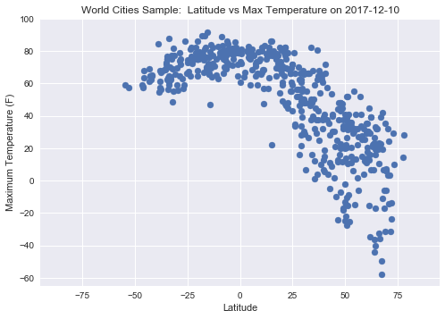
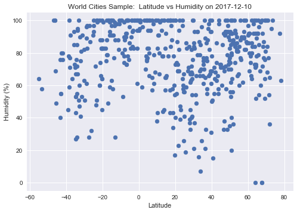
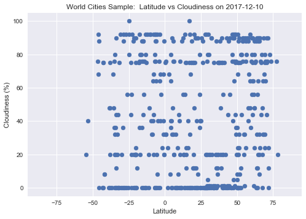
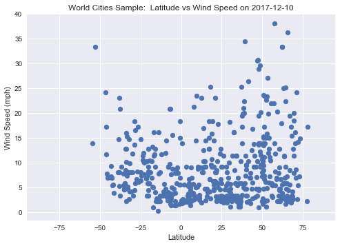

Summary

The code below attempts to find correlations between a city's relative distance from the equator and that city's weather.  518 random world cities' daily weather attributes were sampled on 2017-12-10.  Scatter plots were created to explore these cities maximum temperature, humidity, cloudiness and wind speed vs that of the city's latitude.

Observations

1.  The closer to the equator (0 degrees latitude), the higher the maximum daily temperatures were on average.  This can be seen by the clear inflection point on the 'World Cities Sample:  Latitude vs Max Temperature on 2017-12-10' plot near 0 degrees latitude.

2.  Cities with the highest daily wind readings tend to be further away from the equator.  In this sample, Kodiak, AK (57.79 latitude) had the highest wind reading at 38.03 mph.

3.  The average humidity for the sample was above 75%.  There does not seem to be a strong correlation between that of humidty and latitude.

```python
#Initialize Modules
import requests as req
import json
from citipy import citipy as cp
import random
import pandas as pd
```


```python
#API setup
api_key = '25bc90a1196e6f153eece0bc0b0fc9eb'
units = 'Imperial'
url = 'http://api.openweathermap.org/data/2.5/weather'
```


```python
#Cities Setup - random integers for latitude/longitude
cities_dict = {'city':[],'country':[]}
```


```python
#Build City Dictionary
for x in range(0,1500):
	x = cp.nearest_city(random.randint(-90,90), random.randint(-180,180))
	if x.city_name not in cities_dict['city']:
		cities_dict['city'].append(x.city_name)
		cities_dict['country'].append(x.country_code)
```


```python
#Check that code is working
for city in cities_dict['city']:
	print(city)

len(cities_dict['city'])
```

    kodiak
    tyup
    ugoofaaru
    vaini
    libreville
    kralendijk
    goure
    attawapiskat
    khasan
    malbork
    yellowknife
    punta arenas
    ushuaia
    saldanha
    hobart
    khonuu
    constitucion
    illoqqortoormiut
    mokobeng
    garowe
    ribeira grande
    hasaki
    mecca
    aykhal
    honiara
    mys shmidta
    bredasdorp
    bambous virieux
    busselton
    rikitea
    alofi
    dongsheng
    barrow
    hilo
    inirida
    sergeyevka
    clyde river
    wanning
    kaitangata
    lemesos
    sao filipe
    kununurra
    lebu
    cidreira
    hermanus
    semirom
    bambanglipuro
    takoradi
    atuona
    kholtoson
    port macquarie
    mataura
    avarua
    naze
    holetown
    narsaq
    shima
    ruwi
    albany
    krasnoselkup
    cap malheureux
    kapaa
    ngunguru
    tiksi
    hambantota
    namibe
    esperance
    upernavik
    pevek
    torbay
    tual
    cherskiy
    guerrero negro
    nouadhibou
    laguna
    jamestown
    soyo
    karaul
    portland
    komsomolskiy
    bulawayo
    thyolo
    vestmannaeyjar
    sorsk
    saint-pierre
    olinda
    sukabumi
    policoro
    saint-philippe
    linxia
    ostrovnoy
    port elizabeth
    chuy
    westport
    vostok
    brae
    provost
    cabo san lucas
    sayyan
    kahului
    irara
    waki
    luocheng
    belushya guba
    padang
    qaanaaq
    bheramara
    katakwi
    vaitupu
    nikolskoye
    otautau
    lompoc
    mazsalaca
    cape town
    aklavik
    jiroft
    ponta do sol
    itaituba
    nizhneyansk
    mirabad
    talcahuano
    port alfred
    melita
    taolanaro
    banikoara
    tuktoyaktuk
    liverpool
    asyut
    khatanga
    acarau
    isangel
    semnan
    baykit
    dunedin
    shingu
    port hardy
    yining
    peniche
    dong hoi
    karpathos
    ancud
    broome
    mount gambier
    seoul
    szalkszentmarton
    belaya gora
    lorengau
    mar del plata
    landsberg
    polson
    fare
    svetlyy
    trelew
    slave lake
    madarounfa
    bogatynia
    kedrovyy
    mareeba
    lakhisarai
    suoyarvi
    nizhniy tsasuchey
    nabire
    kerema
    nishihara
    butterworth
    belmonte
    san jose de guanipa
    hithadhoo
    ejura
    butaritari
    east london
    clovis
    lagoa
    lhuntshi
    necochea
    louisbourg
    iqaluit
    sangar
    bengkulu
    chumikan
    vardo
    chokurdakh
    rio grande
    pingliang
    north augusta
    bull savanna
    half moon bay
    nikolayevsk-na-amure
    carnarvon
    bethel
    bac can
    meulaboh
    sao joao da barra
    gorontalo
    barentsburg
    hualmay
    bosaso
    san rafael
    samarai
    nakusp
    lolua
    kysyl-syr
    kyren
    andujar
    thompson
    terrace bay
    astana
    yaan
    ocos
    porto novo
    castro
    dikson
    acapulco
    standerton
    puerto ayora
    cayenne
    katangli
    talnakh
    baghdad
    imbituba
    qianan
    dera bugti
    sitka
    taoudenni
    mananara
    tasiilaq
    ornes
    kuche
    tucuman
    saskylakh
    bayan
    priiskovyy
    pangnirtung
    sobolevo
    nelson bay
    gbadolite
    hamilton
    kruisfontein
    harbour breton
    sao felix do xingu
    nanortalik
    kailua
    nassau
    chulym
    ternate
    haines junction
    tabuk
    dandong
    victoria
    cabra
    kamenskoye
    ferme-neuve
    nome
    benjamin hill
    dakar
    san lawrenz
    fevralsk
    bathsheba
    hay river
    caramoran
    faro
    caravelas
    faya
    tura
    wamba
    souillac
    sambava
    beringovskiy
    vila velha
    kualakapuas
    mahebourg
    pacific grove
    vao
    albion
    sola
    longyearbyen
    kasongo-lunda
    kavaratti
    saint-joseph
    bluff
    margate
    mitsamiouli
    havre
    norman wells
    port hedland
    doctor pedro p. pena
    yinchuan
    new norfolk
    goryachegorsk
    rungata
    richards bay
    saint-augustin
    nerchinskiy zavod
    sanming
    gat
    abonnema
    ntcheu
    pisco
    tuatapere
    mana
    luderitz
    tsihombe
    dabakala
    zhigansk
    nizwa
    mandsaur
    boatlaname
    ampanihy
    lavrentiya
    bundaberg
    teguise
    iramuco
    sioux lookout
    baker city
    leningradskiy
    provideniya
    sechura
    bolungarvik
    lubango
    marcona
    san cristobal
    saint anthony
    rexburg
    akyab
    puerto escondido
    kumluca
    mahdalynivka
    santo tomas
    kamaishi
    wainwright
    satitoa
    vila
    delvine
    bathurst
    harper
    antalaha
    danane
    airai
    sur
    salalah
    springbok
    pamanukan
    yanan
    mandalgovi
    samalaeulu
    bartica
    maragogi
    geraldton
    grindavik
    sentyabrskiy
    mosquera
    salym
    xining
    praia da vitoria
    broken hill
    emerald
    hofn
    severo-kurilsk
    khash
    toamasina
    yuxia
    houma
    gambela
    tumannyy
    keti bandar
    chapais
    yeppoon
    khuldabad
    bilibino
    simoes
    baruun-urt
    palaiokhora
    key west
    grand gaube
    pinotepa nacional
    nynashamn
    kiama
    regina
    karaton
    yarada
    kandrian
    klaksvik
    samusu
    batagay
    kawardha
    batie
    sovetskiy
    stoyba
    glendive
    santo antonio do sudoeste
    havre-saint-pierre
    anito
    nakhon phanom
    antofagasta
    tobolsk
    kampene
    makakilo city
    asau
    foumban
    batemans bay
    san miguel
    arlit
    san andres
    kotka
    touros
    bonavista
    kampot
    dallas
    fairbanks
    boali
    tessalit
    marawi
    quatre cocos
    brigantine
    wahran
    nuuk
    neuquen
    geelong
    kuruman
    rocha
    sorland
    bandarbeyla
    ca mau
    sisimiut
    rawah
    fortuna
    sao raimundo das mangabeiras
    coihaique
    codrington
    amderma
    henties bay
    innisfail
    vendome
    messini
    regen
    vohibinany
    toliary
    sirsa
    vredendal
    eten
    dicabisagan
    ossora
    lere
    ust-nera
    pimentel
    pascagoula
    faanui
    shenjiamen
    solsvik
    pilar
    bati
    coahuayana
    zlatoustovsk
    iracoubo
    huazolotitlan
    monrovia
    male
    kalmunai
    hailar
    maghama
    saleaula
    ahipara
    san pablo
    whitehorse
    kieta
    konstancin-jeziorna
    isabela
    gimli
    kraluv dvur
    ambilobe
    oyama
    calgary
    fairhope
    karachi
    mutsamudu
    san quintin
    niigata
    deputatskiy
    flinders
    yumen
    nguiu
    arraial do cabo
    black river
    xiaoweizhai
    wasilla
    maniitsoq
    pitea
    kreuztal
    tasbuget
    port augusta
    kiunga
    olafsvik
    bone
    gangotri
    ninh binh
    port-gentil
    iquique
    kushima
    eyl
    tomari
    karratha
    abu dhabi
    chudniv
    dmytrivka
    olga
    los llanos de aridane
    calamar
    biskupiec
    sabaudia
    vestmanna
    maymyo
    namatanai
    andros town
    palabuhanratu
    evensk
    chagda
    rongcheng
    kaz
    ostersund
    hvide sande
    strezhevoy
    haibowan
    bodden town
    zilupe
    chernaya kholunitsa
    marzuq
    labuhan
    oistins
    pemba
    topolobampo
    ciras
    chinsali
    findochty
    saint george
    coquimbo
    great yarmouth
    balkhash
    fengrun
    erenhot
    migori
    merrill
    hami
    fasa
    pirna
    ballina
    rawson
    artesia
    umzimvubu
    berdigestyakh
    husavik
    ambodifototra
    lasa
    vila franca do campo
    minab
    sesheke
    along
    katsuura
    svay rieng
    boca do acre
    palmer
    chicama
    bhinga
    morondava
    bo
    riyadh
    warqla
    port blair
    grand-santi
    esso
    yakeshi
    felipe carrillo puerto
    hervey bay
    waverly
    indramayu
    natchitoches
    youhao
    gazli
    dauriya
    concarneau
    serenje
    mangrol
    farah
    milkovo
    makaryev
    yangambi
    beloha
    berlevag
    aloleng
    shasta lake
    skelleftea
    wajima
    adrar
    galveston
    kalanguy
    ilulissat
    korla
    solnechnyy
    poim
    lyuban
    ocampo
    vieux-habitants
    tsogni
    verkhoyansk
    jingdezhen
    madang
    prince rupert
    butembo
    ivankiv
    tarauaca
    nautla
    hit
    lima
    bengkalis
    kavieng
    north bend
    nazca
    


    616


```python
#Change dict to DataFrame
df_cities = pd.DataFrame.from_dict(cities_dict)
df_cities['lon'] = ''
df_cities['lat']= ''
df_cities['tempF']= ''
df_cities['humidity'] = ''
df_cities['wind_speed'] = ''
df_cities['cloudiness'] = ''

df_cities.head()
```


<div>
<style>
    .dataframe thead tr:only-child th {
        text-align: right;
    }

    .dataframe thead th {
        text-align: left;
    }

    .dataframe tbody tr th {
        vertical-align: top;
    }
</style>
<table border="1" class="dataframe">
  <thead>
    <tr style="text-align: right;">
      <th></th>
      <th>city</th>
      <th>country</th>
      <th>lon</th>
      <th>lat</th>
      <th>tempF</th>
      <th>humidity</th>
      <th>wind_speed</th>
      <th>cloudiness</th>
    </tr>
  </thead>
  <tbody>
    <tr>
      <th>0</th>
      <td>kodiak</td>
      <td>us</td>
      <td></td>
      <td></td>
      <td></td>
      <td></td>
      <td></td>
      <td></td>
    </tr>
    <tr>
      <th>1</th>
      <td>tyup</td>
      <td>kg</td>
      <td></td>
      <td></td>
      <td></td>
      <td></td>
      <td></td>
      <td></td>
    </tr>
    <tr>
      <th>2</th>
      <td>ugoofaaru</td>
      <td>mv</td>
      <td></td>
      <td></td>
      <td></td>
      <td></td>
      <td></td>
      <td></td>
    </tr>
    <tr>
      <th>3</th>
      <td>vaini</td>
      <td>to</td>
      <td></td>
      <td></td>
      <td></td>
      <td></td>
      <td></td>
      <td></td>
    </tr>
    <tr>
      <th>4</th>
      <td>libreville</td>
      <td>ga</td>
      <td></td>
      <td></td>
      <td></td>
      <td></td>
      <td></td>
      <td></td>
    </tr>
  </tbody>
</table>
</div>


```python
#Building API Call
for index,row in df_cities.iterrows():

	#Set param_dict
	param_dict = {'appid':api_key,
			'units':units, 
			'q': row['city']+','+row['country']
	}
	
	#Get response
	response = req.get(url,params = param_dict)
	print('Processing '+ str(index+1) + ' of ' +str(len(df_cities['city'])) + ' | ' + 
		row['city']+','+row['country'])
	print(response.url)
	data = response.json()
	#print(json.dumps(data,indent=4))
	
	try:
		#Create dictionary key-value pairs
		row['lon'] = data['coord']['lon']
		row['lat'] = data['coord']['lat']
		row['tempF'] = data['main']['temp_max']
		row['humidity'] = data['main']['humidity']
		row['wind_speed'] = data['wind']['speed']
		row['cloudiness'] = data['clouds']['all']
	except:
		continue

#Check Dataframe structure
df_cities.head()
```

    Processing 1 of 616 | kodiak,us
    http://api.openweathermap.org/data/2.5/weather?appid=25bc90a1196e6f153eece0bc0b0fc9eb&units=Imperial&q=kodiak%2Cus
    Processing 2 of 616 | tyup,kg
    http://api.openweathermap.org/data/2.5/weather?appid=25bc90a1196e6f153eece0bc0b0fc9eb&units=Imperial&q=tyup%2Ckg
    Processing 3 of 616 | ugoofaaru,mv
    http://api.openweathermap.org/data/2.5/weather?appid=25bc90a1196e6f153eece0bc0b0fc9eb&units=Imperial&q=ugoofaaru%2Cmv
    Processing 4 of 616 | vaini,to
    http://api.openweathermap.org/data/2.5/weather?appid=25bc90a1196e6f153eece0bc0b0fc9eb&units=Imperial&q=vaini%2Cto
    Processing 5 of 616 | libreville,ga
    http://api.openweathermap.org/data/2.5/weather?appid=25bc90a1196e6f153eece0bc0b0fc9eb&units=Imperial&q=libreville%2Cga
    Processing 6 of 616 | kralendijk,an
    http://api.openweathermap.org/data/2.5/weather?appid=25bc90a1196e6f153eece0bc0b0fc9eb&units=Imperial&q=kralendijk%2Can
    Processing 7 of 616 | goure,ne
    http://api.openweathermap.org/data/2.5/weather?appid=25bc90a1196e6f153eece0bc0b0fc9eb&units=Imperial&q=goure%2Cne
    Processing 8 of 616 | attawapiskat,ca
    http://api.openweathermap.org/data/2.5/weather?appid=25bc90a1196e6f153eece0bc0b0fc9eb&units=Imperial&q=attawapiskat%2Cca
    Processing 9 of 616 | khasan,ru
    http://api.openweathermap.org/data/2.5/weather?appid=25bc90a1196e6f153eece0bc0b0fc9eb&units=Imperial&q=khasan%2Cru
    Processing 10 of 616 | malbork,pl
    http://api.openweathermap.org/data/2.5/weather?appid=25bc90a1196e6f153eece0bc0b0fc9eb&units=Imperial&q=malbork%2Cpl
    Processing 11 of 616 | yellowknife,ca
    http://api.openweathermap.org/data/2.5/weather?appid=25bc90a1196e6f153eece0bc0b0fc9eb&units=Imperial&q=yellowknife%2Cca
    Processing 12 of 616 | punta arenas,cl
    http://api.openweathermap.org/data/2.5/weather?appid=25bc90a1196e6f153eece0bc0b0fc9eb&units=Imperial&q=punta+arenas%2Ccl
    Processing 13 of 616 | ushuaia,ar
    http://api.openweathermap.org/data/2.5/weather?appid=25bc90a1196e6f153eece0bc0b0fc9eb&units=Imperial&q=ushuaia%2Car
    Processing 14 of 616 | saldanha,za
    http://api.openweathermap.org/data/2.5/weather?appid=25bc90a1196e6f153eece0bc0b0fc9eb&units=Imperial&q=saldanha%2Cza
    Processing 15 of 616 | hobart,au
    http://api.openweathermap.org/data/2.5/weather?appid=25bc90a1196e6f153eece0bc0b0fc9eb&units=Imperial&q=hobart%2Cau
    Processing 16 of 616 | khonuu,ru
    http://api.openweathermap.org/data/2.5/weather?appid=25bc90a1196e6f153eece0bc0b0fc9eb&units=Imperial&q=khonuu%2Cru
    Processing 17 of 616 | constitucion,mx
    http://api.openweathermap.org/data/2.5/weather?appid=25bc90a1196e6f153eece0bc0b0fc9eb&units=Imperial&q=constitucion%2Cmx
    Processing 18 of 616 | illoqqortoormiut,gl
    http://api.openweathermap.org/data/2.5/weather?appid=25bc90a1196e6f153eece0bc0b0fc9eb&units=Imperial&q=illoqqortoormiut%2Cgl
    Processing 19 of 616 | mokobeng,bw
    http://api.openweathermap.org/data/2.5/weather?appid=25bc90a1196e6f153eece0bc0b0fc9eb&units=Imperial&q=mokobeng%2Cbw
    Processing 20 of 616 | garowe,so
    http://api.openweathermap.org/data/2.5/weather?appid=25bc90a1196e6f153eece0bc0b0fc9eb&units=Imperial&q=garowe%2Cso
    Processing 21 of 616 | ribeira grande,pt
    http://api.openweathermap.org/data/2.5/weather?appid=25bc90a1196e6f153eece0bc0b0fc9eb&units=Imperial&q=ribeira+grande%2Cpt
    Processing 22 of 616 | hasaki,jp
    http://api.openweathermap.org/data/2.5/weather?appid=25bc90a1196e6f153eece0bc0b0fc9eb&units=Imperial&q=hasaki%2Cjp
    Processing 23 of 616 | mecca,sa
    http://api.openweathermap.org/data/2.5/weather?appid=25bc90a1196e6f153eece0bc0b0fc9eb&units=Imperial&q=mecca%2Csa
    Processing 24 of 616 | aykhal,ru
    http://api.openweathermap.org/data/2.5/weather?appid=25bc90a1196e6f153eece0bc0b0fc9eb&units=Imperial&q=aykhal%2Cru
    Processing 25 of 616 | honiara,sb
    http://api.openweathermap.org/data/2.5/weather?appid=25bc90a1196e6f153eece0bc0b0fc9eb&units=Imperial&q=honiara%2Csb
    Processing 26 of 616 | mys shmidta,ru
    http://api.openweathermap.org/data/2.5/weather?appid=25bc90a1196e6f153eece0bc0b0fc9eb&units=Imperial&q=mys+shmidta%2Cru
    Processing 27 of 616 | bredasdorp,za
    http://api.openweathermap.org/data/2.5/weather?appid=25bc90a1196e6f153eece0bc0b0fc9eb&units=Imperial&q=bredasdorp%2Cza
    Processing 28 of 616 | bambous virieux,mu
    http://api.openweathermap.org/data/2.5/weather?appid=25bc90a1196e6f153eece0bc0b0fc9eb&units=Imperial&q=bambous+virieux%2Cmu
    Processing 29 of 616 | busselton,au
    http://api.openweathermap.org/data/2.5/weather?appid=25bc90a1196e6f153eece0bc0b0fc9eb&units=Imperial&q=busselton%2Cau
    Processing 30 of 616 | rikitea,pf
    http://api.openweathermap.org/data/2.5/weather?appid=25bc90a1196e6f153eece0bc0b0fc9eb&units=Imperial&q=rikitea%2Cpf
    Processing 31 of 616 | alofi,nu
    http://api.openweathermap.org/data/2.5/weather?appid=25bc90a1196e6f153eece0bc0b0fc9eb&units=Imperial&q=alofi%2Cnu
    Processing 32 of 616 | dongsheng,cn
    http://api.openweathermap.org/data/2.5/weather?appid=25bc90a1196e6f153eece0bc0b0fc9eb&units=Imperial&q=dongsheng%2Ccn
    Processing 33 of 616 | barrow,us
    http://api.openweathermap.org/data/2.5/weather?appid=25bc90a1196e6f153eece0bc0b0fc9eb&units=Imperial&q=barrow%2Cus
    Processing 34 of 616 | hilo,us
    http://api.openweathermap.org/data/2.5/weather?appid=25bc90a1196e6f153eece0bc0b0fc9eb&units=Imperial&q=hilo%2Cus
    Processing 35 of 616 | inirida,co
    http://api.openweathermap.org/data/2.5/weather?appid=25bc90a1196e6f153eece0bc0b0fc9eb&units=Imperial&q=inirida%2Cco
    Processing 36 of 616 | sergeyevka,kz
    http://api.openweathermap.org/data/2.5/weather?appid=25bc90a1196e6f153eece0bc0b0fc9eb&units=Imperial&q=sergeyevka%2Ckz
    Processing 37 of 616 | clyde river,ca
    http://api.openweathermap.org/data/2.5/weather?appid=25bc90a1196e6f153eece0bc0b0fc9eb&units=Imperial&q=clyde+river%2Cca
    Processing 38 of 616 | wanning,cn
    http://api.openweathermap.org/data/2.5/weather?appid=25bc90a1196e6f153eece0bc0b0fc9eb&units=Imperial&q=wanning%2Ccn
    Processing 39 of 616 | kaitangata,nz
    http://api.openweathermap.org/data/2.5/weather?appid=25bc90a1196e6f153eece0bc0b0fc9eb&units=Imperial&q=kaitangata%2Cnz
    Processing 40 of 616 | lemesos,cy
    http://api.openweathermap.org/data/2.5/weather?appid=25bc90a1196e6f153eece0bc0b0fc9eb&units=Imperial&q=lemesos%2Ccy
    Processing 41 of 616 | sao filipe,cv
    http://api.openweathermap.org/data/2.5/weather?appid=25bc90a1196e6f153eece0bc0b0fc9eb&units=Imperial&q=sao+filipe%2Ccv
    Processing 42 of 616 | kununurra,au
    http://api.openweathermap.org/data/2.5/weather?appid=25bc90a1196e6f153eece0bc0b0fc9eb&units=Imperial&q=kununurra%2Cau
    Processing 43 of 616 | lebu,cl
    http://api.openweathermap.org/data/2.5/weather?appid=25bc90a1196e6f153eece0bc0b0fc9eb&units=Imperial&q=lebu%2Ccl
    Processing 44 of 616 | cidreira,br
    http://api.openweathermap.org/data/2.5/weather?appid=25bc90a1196e6f153eece0bc0b0fc9eb&units=Imperial&q=cidreira%2Cbr
    Processing 45 of 616 | hermanus,za
    http://api.openweathermap.org/data/2.5/weather?appid=25bc90a1196e6f153eece0bc0b0fc9eb&units=Imperial&q=hermanus%2Cza
    Processing 46 of 616 | semirom,ir
    http://api.openweathermap.org/data/2.5/weather?appid=25bc90a1196e6f153eece0bc0b0fc9eb&units=Imperial&q=semirom%2Cir
    Processing 47 of 616 | bambanglipuro,id
    http://api.openweathermap.org/data/2.5/weather?appid=25bc90a1196e6f153eece0bc0b0fc9eb&units=Imperial&q=bambanglipuro%2Cid
    Processing 48 of 616 | takoradi,gh
    http://api.openweathermap.org/data/2.5/weather?appid=25bc90a1196e6f153eece0bc0b0fc9eb&units=Imperial&q=takoradi%2Cgh
    Processing 49 of 616 | atuona,pf
    http://api.openweathermap.org/data/2.5/weather?appid=25bc90a1196e6f153eece0bc0b0fc9eb&units=Imperial&q=atuona%2Cpf
    Processing 50 of 616 | kholtoson,ru
    http://api.openweathermap.org/data/2.5/weather?appid=25bc90a1196e6f153eece0bc0b0fc9eb&units=Imperial&q=kholtoson%2Cru
    Processing 51 of 616 | port macquarie,au
    http://api.openweathermap.org/data/2.5/weather?appid=25bc90a1196e6f153eece0bc0b0fc9eb&units=Imperial&q=port+macquarie%2Cau
    Processing 52 of 616 | mataura,pf
    http://api.openweathermap.org/data/2.5/weather?appid=25bc90a1196e6f153eece0bc0b0fc9eb&units=Imperial&q=mataura%2Cpf
    Processing 53 of 616 | avarua,ck
    http://api.openweathermap.org/data/2.5/weather?appid=25bc90a1196e6f153eece0bc0b0fc9eb&units=Imperial&q=avarua%2Cck
    Processing 54 of 616 | naze,jp
    http://api.openweathermap.org/data/2.5/weather?appid=25bc90a1196e6f153eece0bc0b0fc9eb&units=Imperial&q=naze%2Cjp
    Processing 55 of 616 | holetown,bb
    http://api.openweathermap.org/data/2.5/weather?appid=25bc90a1196e6f153eece0bc0b0fc9eb&units=Imperial&q=holetown%2Cbb
    Processing 56 of 616 | narsaq,gl
    http://api.openweathermap.org/data/2.5/weather?appid=25bc90a1196e6f153eece0bc0b0fc9eb&units=Imperial&q=narsaq%2Cgl
    Processing 57 of 616 | shima,cn
    http://api.openweathermap.org/data/2.5/weather?appid=25bc90a1196e6f153eece0bc0b0fc9eb&units=Imperial&q=shima%2Ccn
    Processing 58 of 616 | ruwi,om
    http://api.openweathermap.org/data/2.5/weather?appid=25bc90a1196e6f153eece0bc0b0fc9eb&units=Imperial&q=ruwi%2Com
    Processing 59 of 616 | albany,au
    http://api.openweathermap.org/data/2.5/weather?appid=25bc90a1196e6f153eece0bc0b0fc9eb&units=Imperial&q=albany%2Cau
    Processing 60 of 616 | krasnoselkup,ru
    http://api.openweathermap.org/data/2.5/weather?appid=25bc90a1196e6f153eece0bc0b0fc9eb&units=Imperial&q=krasnoselkup%2Cru
    Processing 61 of 616 | cap malheureux,mu
    http://api.openweathermap.org/data/2.5/weather?appid=25bc90a1196e6f153eece0bc0b0fc9eb&units=Imperial&q=cap+malheureux%2Cmu
    Processing 62 of 616 | kapaa,us
    http://api.openweathermap.org/data/2.5/weather?appid=25bc90a1196e6f153eece0bc0b0fc9eb&units=Imperial&q=kapaa%2Cus
    Processing 63 of 616 | ngunguru,nz
    http://api.openweathermap.org/data/2.5/weather?appid=25bc90a1196e6f153eece0bc0b0fc9eb&units=Imperial&q=ngunguru%2Cnz
    Processing 64 of 616 | tiksi,ru
    http://api.openweathermap.org/data/2.5/weather?appid=25bc90a1196e6f153eece0bc0b0fc9eb&units=Imperial&q=tiksi%2Cru
    Processing 65 of 616 | hambantota,lk
    http://api.openweathermap.org/data/2.5/weather?appid=25bc90a1196e6f153eece0bc0b0fc9eb&units=Imperial&q=hambantota%2Clk
    Processing 66 of 616 | namibe,ao
    http://api.openweathermap.org/data/2.5/weather?appid=25bc90a1196e6f153eece0bc0b0fc9eb&units=Imperial&q=namibe%2Cao
    Processing 67 of 616 | esperance,au
    http://api.openweathermap.org/data/2.5/weather?appid=25bc90a1196e6f153eece0bc0b0fc9eb&units=Imperial&q=esperance%2Cau
    Processing 68 of 616 | upernavik,gl
    http://api.openweathermap.org/data/2.5/weather?appid=25bc90a1196e6f153eece0bc0b0fc9eb&units=Imperial&q=upernavik%2Cgl
    Processing 69 of 616 | pevek,ru
    http://api.openweathermap.org/data/2.5/weather?appid=25bc90a1196e6f153eece0bc0b0fc9eb&units=Imperial&q=pevek%2Cru
    Processing 70 of 616 | torbay,ca
    http://api.openweathermap.org/data/2.5/weather?appid=25bc90a1196e6f153eece0bc0b0fc9eb&units=Imperial&q=torbay%2Cca
    Processing 71 of 616 | tual,id
    http://api.openweathermap.org/data/2.5/weather?appid=25bc90a1196e6f153eece0bc0b0fc9eb&units=Imperial&q=tual%2Cid
    Processing 72 of 616 | cherskiy,ru
    http://api.openweathermap.org/data/2.5/weather?appid=25bc90a1196e6f153eece0bc0b0fc9eb&units=Imperial&q=cherskiy%2Cru
    Processing 73 of 616 | guerrero negro,mx
    http://api.openweathermap.org/data/2.5/weather?appid=25bc90a1196e6f153eece0bc0b0fc9eb&units=Imperial&q=guerrero+negro%2Cmx
    Processing 74 of 616 | nouadhibou,mr
    http://api.openweathermap.org/data/2.5/weather?appid=25bc90a1196e6f153eece0bc0b0fc9eb&units=Imperial&q=nouadhibou%2Cmr
    Processing 75 of 616 | laguna,br
    http://api.openweathermap.org/data/2.5/weather?appid=25bc90a1196e6f153eece0bc0b0fc9eb&units=Imperial&q=laguna%2Cbr
    Processing 76 of 616 | jamestown,sh
    http://api.openweathermap.org/data/2.5/weather?appid=25bc90a1196e6f153eece0bc0b0fc9eb&units=Imperial&q=jamestown%2Csh
    Processing 77 of 616 | soyo,ao
    http://api.openweathermap.org/data/2.5/weather?appid=25bc90a1196e6f153eece0bc0b0fc9eb&units=Imperial&q=soyo%2Cao
    Processing 78 of 616 | karaul,ru
    http://api.openweathermap.org/data/2.5/weather?appid=25bc90a1196e6f153eece0bc0b0fc9eb&units=Imperial&q=karaul%2Cru
    Processing 79 of 616 | portland,au
    http://api.openweathermap.org/data/2.5/weather?appid=25bc90a1196e6f153eece0bc0b0fc9eb&units=Imperial&q=portland%2Cau
    Processing 80 of 616 | komsomolskiy,ru
    http://api.openweathermap.org/data/2.5/weather?appid=25bc90a1196e6f153eece0bc0b0fc9eb&units=Imperial&q=komsomolskiy%2Cru
    Processing 81 of 616 | bulawayo,zw
    http://api.openweathermap.org/data/2.5/weather?appid=25bc90a1196e6f153eece0bc0b0fc9eb&units=Imperial&q=bulawayo%2Czw
    Processing 82 of 616 | thyolo,mw
    http://api.openweathermap.org/data/2.5/weather?appid=25bc90a1196e6f153eece0bc0b0fc9eb&units=Imperial&q=thyolo%2Cmw
    Processing 83 of 616 | vestmannaeyjar,is
    http://api.openweathermap.org/data/2.5/weather?appid=25bc90a1196e6f153eece0bc0b0fc9eb&units=Imperial&q=vestmannaeyjar%2Cis
    Processing 84 of 616 | sorsk,ru
    http://api.openweathermap.org/data/2.5/weather?appid=25bc90a1196e6f153eece0bc0b0fc9eb&units=Imperial&q=sorsk%2Cru
    Processing 85 of 616 | saint-pierre,pm
    http://api.openweathermap.org/data/2.5/weather?appid=25bc90a1196e6f153eece0bc0b0fc9eb&units=Imperial&q=saint-pierre%2Cpm
    Processing 86 of 616 | olinda,br
    http://api.openweathermap.org/data/2.5/weather?appid=25bc90a1196e6f153eece0bc0b0fc9eb&units=Imperial&q=olinda%2Cbr
    Processing 87 of 616 | sukabumi,id
    http://api.openweathermap.org/data/2.5/weather?appid=25bc90a1196e6f153eece0bc0b0fc9eb&units=Imperial&q=sukabumi%2Cid
    Processing 88 of 616 | policoro,it
    http://api.openweathermap.org/data/2.5/weather?appid=25bc90a1196e6f153eece0bc0b0fc9eb&units=Imperial&q=policoro%2Cit
    Processing 89 of 616 | saint-philippe,re
    http://api.openweathermap.org/data/2.5/weather?appid=25bc90a1196e6f153eece0bc0b0fc9eb&units=Imperial&q=saint-philippe%2Cre
    Processing 90 of 616 | linxia,cn
    http://api.openweathermap.org/data/2.5/weather?appid=25bc90a1196e6f153eece0bc0b0fc9eb&units=Imperial&q=linxia%2Ccn
    Processing 91 of 616 | ostrovnoy,ru
    http://api.openweathermap.org/data/2.5/weather?appid=25bc90a1196e6f153eece0bc0b0fc9eb&units=Imperial&q=ostrovnoy%2Cru
    Processing 92 of 616 | port elizabeth,za
    http://api.openweathermap.org/data/2.5/weather?appid=25bc90a1196e6f153eece0bc0b0fc9eb&units=Imperial&q=port+elizabeth%2Cza
    Processing 93 of 616 | chuy,uy
    http://api.openweathermap.org/data/2.5/weather?appid=25bc90a1196e6f153eece0bc0b0fc9eb&units=Imperial&q=chuy%2Cuy
    Processing 94 of 616 | westport,nz
    http://api.openweathermap.org/data/2.5/weather?appid=25bc90a1196e6f153eece0bc0b0fc9eb&units=Imperial&q=westport%2Cnz
    Processing 95 of 616 | vostok,ru
    http://api.openweathermap.org/data/2.5/weather?appid=25bc90a1196e6f153eece0bc0b0fc9eb&units=Imperial&q=vostok%2Cru
    Processing 96 of 616 | brae,gb
    http://api.openweathermap.org/data/2.5/weather?appid=25bc90a1196e6f153eece0bc0b0fc9eb&units=Imperial&q=brae%2Cgb
    Processing 97 of 616 | provost,ca
    http://api.openweathermap.org/data/2.5/weather?appid=25bc90a1196e6f153eece0bc0b0fc9eb&units=Imperial&q=provost%2Cca
    Processing 98 of 616 | cabo san lucas,mx
    http://api.openweathermap.org/data/2.5/weather?appid=25bc90a1196e6f153eece0bc0b0fc9eb&units=Imperial&q=cabo+san+lucas%2Cmx
    Processing 99 of 616 | sayyan,ye
    http://api.openweathermap.org/data/2.5/weather?appid=25bc90a1196e6f153eece0bc0b0fc9eb&units=Imperial&q=sayyan%2Cye
    Processing 100 of 616 | kahului,us
    http://api.openweathermap.org/data/2.5/weather?appid=25bc90a1196e6f153eece0bc0b0fc9eb&units=Imperial&q=kahului%2Cus
    Processing 101 of 616 | irara,br
    http://api.openweathermap.org/data/2.5/weather?appid=25bc90a1196e6f153eece0bc0b0fc9eb&units=Imperial&q=irara%2Cbr
    Processing 102 of 616 | waki,jp
    http://api.openweathermap.org/data/2.5/weather?appid=25bc90a1196e6f153eece0bc0b0fc9eb&units=Imperial&q=waki%2Cjp
    Processing 103 of 616 | luocheng,cn
    http://api.openweathermap.org/data/2.5/weather?appid=25bc90a1196e6f153eece0bc0b0fc9eb&units=Imperial&q=luocheng%2Ccn
    Processing 104 of 616 | belushya guba,ru
    http://api.openweathermap.org/data/2.5/weather?appid=25bc90a1196e6f153eece0bc0b0fc9eb&units=Imperial&q=belushya+guba%2Cru
    Processing 105 of 616 | padang,id
    http://api.openweathermap.org/data/2.5/weather?appid=25bc90a1196e6f153eece0bc0b0fc9eb&units=Imperial&q=padang%2Cid
    Processing 106 of 616 | qaanaaq,gl
    http://api.openweathermap.org/data/2.5/weather?appid=25bc90a1196e6f153eece0bc0b0fc9eb&units=Imperial&q=qaanaaq%2Cgl
    Processing 107 of 616 | bheramara,bd
    http://api.openweathermap.org/data/2.5/weather?appid=25bc90a1196e6f153eece0bc0b0fc9eb&units=Imperial&q=bheramara%2Cbd
    Processing 108 of 616 | katakwi,ug
    http://api.openweathermap.org/data/2.5/weather?appid=25bc90a1196e6f153eece0bc0b0fc9eb&units=Imperial&q=katakwi%2Cug
    Processing 109 of 616 | vaitupu,wf
    http://api.openweathermap.org/data/2.5/weather?appid=25bc90a1196e6f153eece0bc0b0fc9eb&units=Imperial&q=vaitupu%2Cwf
    Processing 110 of 616 | nikolskoye,ru
    http://api.openweathermap.org/data/2.5/weather?appid=25bc90a1196e6f153eece0bc0b0fc9eb&units=Imperial&q=nikolskoye%2Cru
    Processing 111 of 616 | otautau,nz
    http://api.openweathermap.org/data/2.5/weather?appid=25bc90a1196e6f153eece0bc0b0fc9eb&units=Imperial&q=otautau%2Cnz
    Processing 112 of 616 | lompoc,us
    http://api.openweathermap.org/data/2.5/weather?appid=25bc90a1196e6f153eece0bc0b0fc9eb&units=Imperial&q=lompoc%2Cus
    Processing 113 of 616 | mazsalaca,lv
    http://api.openweathermap.org/data/2.5/weather?appid=25bc90a1196e6f153eece0bc0b0fc9eb&units=Imperial&q=mazsalaca%2Clv
    Processing 114 of 616 | cape town,za
    http://api.openweathermap.org/data/2.5/weather?appid=25bc90a1196e6f153eece0bc0b0fc9eb&units=Imperial&q=cape+town%2Cza
    Processing 115 of 616 | aklavik,ca
    http://api.openweathermap.org/data/2.5/weather?appid=25bc90a1196e6f153eece0bc0b0fc9eb&units=Imperial&q=aklavik%2Cca
    Processing 116 of 616 | jiroft,ir
    http://api.openweathermap.org/data/2.5/weather?appid=25bc90a1196e6f153eece0bc0b0fc9eb&units=Imperial&q=jiroft%2Cir
    Processing 117 of 616 | ponta do sol,cv
    http://api.openweathermap.org/data/2.5/weather?appid=25bc90a1196e6f153eece0bc0b0fc9eb&units=Imperial&q=ponta+do+sol%2Ccv
    Processing 118 of 616 | itaituba,br
    http://api.openweathermap.org/data/2.5/weather?appid=25bc90a1196e6f153eece0bc0b0fc9eb&units=Imperial&q=itaituba%2Cbr
    Processing 119 of 616 | nizhneyansk,ru
    http://api.openweathermap.org/data/2.5/weather?appid=25bc90a1196e6f153eece0bc0b0fc9eb&units=Imperial&q=nizhneyansk%2Cru
    Processing 120 of 616 | mirabad,af
    http://api.openweathermap.org/data/2.5/weather?appid=25bc90a1196e6f153eece0bc0b0fc9eb&units=Imperial&q=mirabad%2Caf
    Processing 121 of 616 | talcahuano,cl
    http://api.openweathermap.org/data/2.5/weather?appid=25bc90a1196e6f153eece0bc0b0fc9eb&units=Imperial&q=talcahuano%2Ccl
    Processing 122 of 616 | port alfred,za
    http://api.openweathermap.org/data/2.5/weather?appid=25bc90a1196e6f153eece0bc0b0fc9eb&units=Imperial&q=port+alfred%2Cza
    Processing 123 of 616 | melita,ca
    http://api.openweathermap.org/data/2.5/weather?appid=25bc90a1196e6f153eece0bc0b0fc9eb&units=Imperial&q=melita%2Cca
    Processing 124 of 616 | taolanaro,mg
    http://api.openweathermap.org/data/2.5/weather?appid=25bc90a1196e6f153eece0bc0b0fc9eb&units=Imperial&q=taolanaro%2Cmg
    Processing 125 of 616 | banikoara,bj
    http://api.openweathermap.org/data/2.5/weather?appid=25bc90a1196e6f153eece0bc0b0fc9eb&units=Imperial&q=banikoara%2Cbj
    Processing 126 of 616 | tuktoyaktuk,ca
    http://api.openweathermap.org/data/2.5/weather?appid=25bc90a1196e6f153eece0bc0b0fc9eb&units=Imperial&q=tuktoyaktuk%2Cca
    Processing 127 of 616 | liverpool,ca
    http://api.openweathermap.org/data/2.5/weather?appid=25bc90a1196e6f153eece0bc0b0fc9eb&units=Imperial&q=liverpool%2Cca
    Processing 128 of 616 | asyut,eg
    http://api.openweathermap.org/data/2.5/weather?appid=25bc90a1196e6f153eece0bc0b0fc9eb&units=Imperial&q=asyut%2Ceg
    Processing 129 of 616 | khatanga,ru
    http://api.openweathermap.org/data/2.5/weather?appid=25bc90a1196e6f153eece0bc0b0fc9eb&units=Imperial&q=khatanga%2Cru
    Processing 130 of 616 | acarau,br
    http://api.openweathermap.org/data/2.5/weather?appid=25bc90a1196e6f153eece0bc0b0fc9eb&units=Imperial&q=acarau%2Cbr
    Processing 131 of 616 | isangel,vu
    http://api.openweathermap.org/data/2.5/weather?appid=25bc90a1196e6f153eece0bc0b0fc9eb&units=Imperial&q=isangel%2Cvu
    Processing 132 of 616 | semnan,ir
    http://api.openweathermap.org/data/2.5/weather?appid=25bc90a1196e6f153eece0bc0b0fc9eb&units=Imperial&q=semnan%2Cir
    Processing 133 of 616 | baykit,ru
    http://api.openweathermap.org/data/2.5/weather?appid=25bc90a1196e6f153eece0bc0b0fc9eb&units=Imperial&q=baykit%2Cru
    Processing 134 of 616 | dunedin,nz
    http://api.openweathermap.org/data/2.5/weather?appid=25bc90a1196e6f153eece0bc0b0fc9eb&units=Imperial&q=dunedin%2Cnz
    Processing 135 of 616 | shingu,jp
    http://api.openweathermap.org/data/2.5/weather?appid=25bc90a1196e6f153eece0bc0b0fc9eb&units=Imperial&q=shingu%2Cjp
    Processing 136 of 616 | port hardy,ca
    http://api.openweathermap.org/data/2.5/weather?appid=25bc90a1196e6f153eece0bc0b0fc9eb&units=Imperial&q=port+hardy%2Cca
    Processing 137 of 616 | yining,cn
    http://api.openweathermap.org/data/2.5/weather?appid=25bc90a1196e6f153eece0bc0b0fc9eb&units=Imperial&q=yining%2Ccn
    Processing 138 of 616 | peniche,pt
    http://api.openweathermap.org/data/2.5/weather?appid=25bc90a1196e6f153eece0bc0b0fc9eb&units=Imperial&q=peniche%2Cpt
    Processing 139 of 616 | dong hoi,vn
    http://api.openweathermap.org/data/2.5/weather?appid=25bc90a1196e6f153eece0bc0b0fc9eb&units=Imperial&q=dong+hoi%2Cvn
    Processing 140 of 616 | karpathos,gr
    http://api.openweathermap.org/data/2.5/weather?appid=25bc90a1196e6f153eece0bc0b0fc9eb&units=Imperial&q=karpathos%2Cgr
    Processing 141 of 616 | ancud,cl
    http://api.openweathermap.org/data/2.5/weather?appid=25bc90a1196e6f153eece0bc0b0fc9eb&units=Imperial&q=ancud%2Ccl
    Processing 142 of 616 | broome,au
    http://api.openweathermap.org/data/2.5/weather?appid=25bc90a1196e6f153eece0bc0b0fc9eb&units=Imperial&q=broome%2Cau
    Processing 143 of 616 | mount gambier,au
    http://api.openweathermap.org/data/2.5/weather?appid=25bc90a1196e6f153eece0bc0b0fc9eb&units=Imperial&q=mount+gambier%2Cau
    Processing 144 of 616 | seoul,kr
    http://api.openweathermap.org/data/2.5/weather?appid=25bc90a1196e6f153eece0bc0b0fc9eb&units=Imperial&q=seoul%2Ckr
    Processing 145 of 616 | szalkszentmarton,hu
    http://api.openweathermap.org/data/2.5/weather?appid=25bc90a1196e6f153eece0bc0b0fc9eb&units=Imperial&q=szalkszentmarton%2Chu
    Processing 146 of 616 | belaya gora,ru
    http://api.openweathermap.org/data/2.5/weather?appid=25bc90a1196e6f153eece0bc0b0fc9eb&units=Imperial&q=belaya+gora%2Cru
    Processing 147 of 616 | lorengau,pg
    http://api.openweathermap.org/data/2.5/weather?appid=25bc90a1196e6f153eece0bc0b0fc9eb&units=Imperial&q=lorengau%2Cpg
    Processing 148 of 616 | mar del plata,ar
    http://api.openweathermap.org/data/2.5/weather?appid=25bc90a1196e6f153eece0bc0b0fc9eb&units=Imperial&q=mar+del+plata%2Car
    Processing 149 of 616 | landsberg,de
    http://api.openweathermap.org/data/2.5/weather?appid=25bc90a1196e6f153eece0bc0b0fc9eb&units=Imperial&q=landsberg%2Cde
    Processing 150 of 616 | polson,us
    http://api.openweathermap.org/data/2.5/weather?appid=25bc90a1196e6f153eece0bc0b0fc9eb&units=Imperial&q=polson%2Cus
    Processing 151 of 616 | fare,pf
    http://api.openweathermap.org/data/2.5/weather?appid=25bc90a1196e6f153eece0bc0b0fc9eb&units=Imperial&q=fare%2Cpf
    Processing 152 of 616 | svetlyy,ru
    http://api.openweathermap.org/data/2.5/weather?appid=25bc90a1196e6f153eece0bc0b0fc9eb&units=Imperial&q=svetlyy%2Cru
    Processing 153 of 616 | trelew,ar
    http://api.openweathermap.org/data/2.5/weather?appid=25bc90a1196e6f153eece0bc0b0fc9eb&units=Imperial&q=trelew%2Car
    Processing 154 of 616 | slave lake,ca
    http://api.openweathermap.org/data/2.5/weather?appid=25bc90a1196e6f153eece0bc0b0fc9eb&units=Imperial&q=slave+lake%2Cca
    Processing 155 of 616 | madarounfa,ne
    http://api.openweathermap.org/data/2.5/weather?appid=25bc90a1196e6f153eece0bc0b0fc9eb&units=Imperial&q=madarounfa%2Cne
    Processing 156 of 616 | bogatynia,pl
    http://api.openweathermap.org/data/2.5/weather?appid=25bc90a1196e6f153eece0bc0b0fc9eb&units=Imperial&q=bogatynia%2Cpl
    Processing 157 of 616 | kedrovyy,ru
    http://api.openweathermap.org/data/2.5/weather?appid=25bc90a1196e6f153eece0bc0b0fc9eb&units=Imperial&q=kedrovyy%2Cru
    Processing 158 of 616 | mareeba,au
    http://api.openweathermap.org/data/2.5/weather?appid=25bc90a1196e6f153eece0bc0b0fc9eb&units=Imperial&q=mareeba%2Cau
    Processing 159 of 616 | lakhisarai,in
    http://api.openweathermap.org/data/2.5/weather?appid=25bc90a1196e6f153eece0bc0b0fc9eb&units=Imperial&q=lakhisarai%2Cin
    Processing 160 of 616 | suoyarvi,ru
    http://api.openweathermap.org/data/2.5/weather?appid=25bc90a1196e6f153eece0bc0b0fc9eb&units=Imperial&q=suoyarvi%2Cru
    Processing 161 of 616 | nizhniy tsasuchey,ru
    http://api.openweathermap.org/data/2.5/weather?appid=25bc90a1196e6f153eece0bc0b0fc9eb&units=Imperial&q=nizhniy+tsasuchey%2Cru
    Processing 162 of 616 | nabire,id
    http://api.openweathermap.org/data/2.5/weather?appid=25bc90a1196e6f153eece0bc0b0fc9eb&units=Imperial&q=nabire%2Cid
    Processing 163 of 616 | kerema,pg
    http://api.openweathermap.org/data/2.5/weather?appid=25bc90a1196e6f153eece0bc0b0fc9eb&units=Imperial&q=kerema%2Cpg
    Processing 164 of 616 | nishihara,jp
    http://api.openweathermap.org/data/2.5/weather?appid=25bc90a1196e6f153eece0bc0b0fc9eb&units=Imperial&q=nishihara%2Cjp
    Processing 165 of 616 | butterworth,za
    http://api.openweathermap.org/data/2.5/weather?appid=25bc90a1196e6f153eece0bc0b0fc9eb&units=Imperial&q=butterworth%2Cza
    Processing 166 of 616 | belmonte,br
    http://api.openweathermap.org/data/2.5/weather?appid=25bc90a1196e6f153eece0bc0b0fc9eb&units=Imperial&q=belmonte%2Cbr
    Processing 167 of 616 | san jose de guanipa,ve
    http://api.openweathermap.org/data/2.5/weather?appid=25bc90a1196e6f153eece0bc0b0fc9eb&units=Imperial&q=san+jose+de+guanipa%2Cve
    Processing 168 of 616 | hithadhoo,mv
    http://api.openweathermap.org/data/2.5/weather?appid=25bc90a1196e6f153eece0bc0b0fc9eb&units=Imperial&q=hithadhoo%2Cmv
    Processing 169 of 616 | ejura,gh
    http://api.openweathermap.org/data/2.5/weather?appid=25bc90a1196e6f153eece0bc0b0fc9eb&units=Imperial&q=ejura%2Cgh
    Processing 170 of 616 | butaritari,ki
    http://api.openweathermap.org/data/2.5/weather?appid=25bc90a1196e6f153eece0bc0b0fc9eb&units=Imperial&q=butaritari%2Cki
    Processing 171 of 616 | east london,za
    http://api.openweathermap.org/data/2.5/weather?appid=25bc90a1196e6f153eece0bc0b0fc9eb&units=Imperial&q=east+london%2Cza
    Processing 172 of 616 | clovis,us
    http://api.openweathermap.org/data/2.5/weather?appid=25bc90a1196e6f153eece0bc0b0fc9eb&units=Imperial&q=clovis%2Cus
    Processing 173 of 616 | lagoa,pt
    http://api.openweathermap.org/data/2.5/weather?appid=25bc90a1196e6f153eece0bc0b0fc9eb&units=Imperial&q=lagoa%2Cpt
    Processing 174 of 616 | lhuntshi,bt
    http://api.openweathermap.org/data/2.5/weather?appid=25bc90a1196e6f153eece0bc0b0fc9eb&units=Imperial&q=lhuntshi%2Cbt
    Processing 175 of 616 | necochea,ar
    http://api.openweathermap.org/data/2.5/weather?appid=25bc90a1196e6f153eece0bc0b0fc9eb&units=Imperial&q=necochea%2Car
    Processing 176 of 616 | louisbourg,ca
    http://api.openweathermap.org/data/2.5/weather?appid=25bc90a1196e6f153eece0bc0b0fc9eb&units=Imperial&q=louisbourg%2Cca
    Processing 177 of 616 | iqaluit,ca
    http://api.openweathermap.org/data/2.5/weather?appid=25bc90a1196e6f153eece0bc0b0fc9eb&units=Imperial&q=iqaluit%2Cca
    Processing 178 of 616 | sangar,ru
    http://api.openweathermap.org/data/2.5/weather?appid=25bc90a1196e6f153eece0bc0b0fc9eb&units=Imperial&q=sangar%2Cru
    Processing 179 of 616 | bengkulu,id
    http://api.openweathermap.org/data/2.5/weather?appid=25bc90a1196e6f153eece0bc0b0fc9eb&units=Imperial&q=bengkulu%2Cid
    Processing 180 of 616 | chumikan,ru
    http://api.openweathermap.org/data/2.5/weather?appid=25bc90a1196e6f153eece0bc0b0fc9eb&units=Imperial&q=chumikan%2Cru
    Processing 181 of 616 | vardo,no
    http://api.openweathermap.org/data/2.5/weather?appid=25bc90a1196e6f153eece0bc0b0fc9eb&units=Imperial&q=vardo%2Cno
    Processing 182 of 616 | chokurdakh,ru
    http://api.openweathermap.org/data/2.5/weather?appid=25bc90a1196e6f153eece0bc0b0fc9eb&units=Imperial&q=chokurdakh%2Cru
    Processing 183 of 616 | rio grande,br
    http://api.openweathermap.org/data/2.5/weather?appid=25bc90a1196e6f153eece0bc0b0fc9eb&units=Imperial&q=rio+grande%2Cbr
    Processing 184 of 616 | pingliang,cn
    http://api.openweathermap.org/data/2.5/weather?appid=25bc90a1196e6f153eece0bc0b0fc9eb&units=Imperial&q=pingliang%2Ccn
    Processing 185 of 616 | north augusta,us
    http://api.openweathermap.org/data/2.5/weather?appid=25bc90a1196e6f153eece0bc0b0fc9eb&units=Imperial&q=north+augusta%2Cus
    Processing 186 of 616 | bull savanna,jm
    http://api.openweathermap.org/data/2.5/weather?appid=25bc90a1196e6f153eece0bc0b0fc9eb&units=Imperial&q=bull+savanna%2Cjm
    Processing 187 of 616 | half moon bay,us
    http://api.openweathermap.org/data/2.5/weather?appid=25bc90a1196e6f153eece0bc0b0fc9eb&units=Imperial&q=half+moon+bay%2Cus
    Processing 188 of 616 | nikolayevsk-na-amure,ru
    http://api.openweathermap.org/data/2.5/weather?appid=25bc90a1196e6f153eece0bc0b0fc9eb&units=Imperial&q=nikolayevsk-na-amure%2Cru
    Processing 189 of 616 | carnarvon,au
    http://api.openweathermap.org/data/2.5/weather?appid=25bc90a1196e6f153eece0bc0b0fc9eb&units=Imperial&q=carnarvon%2Cau
    Processing 190 of 616 | bethel,us
    http://api.openweathermap.org/data/2.5/weather?appid=25bc90a1196e6f153eece0bc0b0fc9eb&units=Imperial&q=bethel%2Cus
    Processing 191 of 616 | bac can,vn
    http://api.openweathermap.org/data/2.5/weather?appid=25bc90a1196e6f153eece0bc0b0fc9eb&units=Imperial&q=bac+can%2Cvn
    Processing 192 of 616 | meulaboh,id
    http://api.openweathermap.org/data/2.5/weather?appid=25bc90a1196e6f153eece0bc0b0fc9eb&units=Imperial&q=meulaboh%2Cid
    Processing 193 of 616 | sao joao da barra,br
    http://api.openweathermap.org/data/2.5/weather?appid=25bc90a1196e6f153eece0bc0b0fc9eb&units=Imperial&q=sao+joao+da+barra%2Cbr
    Processing 194 of 616 | gorontalo,id
    http://api.openweathermap.org/data/2.5/weather?appid=25bc90a1196e6f153eece0bc0b0fc9eb&units=Imperial&q=gorontalo%2Cid
    Processing 195 of 616 | barentsburg,sj
    http://api.openweathermap.org/data/2.5/weather?appid=25bc90a1196e6f153eece0bc0b0fc9eb&units=Imperial&q=barentsburg%2Csj
    Processing 196 of 616 | hualmay,pe
    http://api.openweathermap.org/data/2.5/weather?appid=25bc90a1196e6f153eece0bc0b0fc9eb&units=Imperial&q=hualmay%2Cpe
    Processing 197 of 616 | bosaso,so
    http://api.openweathermap.org/data/2.5/weather?appid=25bc90a1196e6f153eece0bc0b0fc9eb&units=Imperial&q=bosaso%2Cso
    Processing 198 of 616 | san rafael,ar
    http://api.openweathermap.org/data/2.5/weather?appid=25bc90a1196e6f153eece0bc0b0fc9eb&units=Imperial&q=san+rafael%2Car
    Processing 199 of 616 | samarai,pg
    http://api.openweathermap.org/data/2.5/weather?appid=25bc90a1196e6f153eece0bc0b0fc9eb&units=Imperial&q=samarai%2Cpg
    Processing 200 of 616 | nakusp,ca
    http://api.openweathermap.org/data/2.5/weather?appid=25bc90a1196e6f153eece0bc0b0fc9eb&units=Imperial&q=nakusp%2Cca
    Processing 201 of 616 | lolua,tv
    http://api.openweathermap.org/data/2.5/weather?appid=25bc90a1196e6f153eece0bc0b0fc9eb&units=Imperial&q=lolua%2Ctv
    Processing 202 of 616 | kysyl-syr,ru
    http://api.openweathermap.org/data/2.5/weather?appid=25bc90a1196e6f153eece0bc0b0fc9eb&units=Imperial&q=kysyl-syr%2Cru
    Processing 203 of 616 | kyren,ru
    http://api.openweathermap.org/data/2.5/weather?appid=25bc90a1196e6f153eece0bc0b0fc9eb&units=Imperial&q=kyren%2Cru
    Processing 204 of 616 | andujar,es
    http://api.openweathermap.org/data/2.5/weather?appid=25bc90a1196e6f153eece0bc0b0fc9eb&units=Imperial&q=andujar%2Ces
    Processing 205 of 616 | thompson,ca
    http://api.openweathermap.org/data/2.5/weather?appid=25bc90a1196e6f153eece0bc0b0fc9eb&units=Imperial&q=thompson%2Cca
    Processing 206 of 616 | terrace bay,ca
    http://api.openweathermap.org/data/2.5/weather?appid=25bc90a1196e6f153eece0bc0b0fc9eb&units=Imperial&q=terrace+bay%2Cca
    Processing 207 of 616 | astana,kz
    http://api.openweathermap.org/data/2.5/weather?appid=25bc90a1196e6f153eece0bc0b0fc9eb&units=Imperial&q=astana%2Ckz
    Processing 208 of 616 | yaan,cn
    http://api.openweathermap.org/data/2.5/weather?appid=25bc90a1196e6f153eece0bc0b0fc9eb&units=Imperial&q=yaan%2Ccn
    Processing 209 of 616 | ocos,gt
    http://api.openweathermap.org/data/2.5/weather?appid=25bc90a1196e6f153eece0bc0b0fc9eb&units=Imperial&q=ocos%2Cgt
    Processing 210 of 616 | porto novo,cv
    http://api.openweathermap.org/data/2.5/weather?appid=25bc90a1196e6f153eece0bc0b0fc9eb&units=Imperial&q=porto+novo%2Ccv
    Processing 211 of 616 | castro,cl
    http://api.openweathermap.org/data/2.5/weather?appid=25bc90a1196e6f153eece0bc0b0fc9eb&units=Imperial&q=castro%2Ccl
    Processing 212 of 616 | dikson,ru
    http://api.openweathermap.org/data/2.5/weather?appid=25bc90a1196e6f153eece0bc0b0fc9eb&units=Imperial&q=dikson%2Cru
    Processing 213 of 616 | acapulco,mx
    http://api.openweathermap.org/data/2.5/weather?appid=25bc90a1196e6f153eece0bc0b0fc9eb&units=Imperial&q=acapulco%2Cmx
    Processing 214 of 616 | standerton,za
    http://api.openweathermap.org/data/2.5/weather?appid=25bc90a1196e6f153eece0bc0b0fc9eb&units=Imperial&q=standerton%2Cza
    Processing 215 of 616 | puerto ayora,ec
    http://api.openweathermap.org/data/2.5/weather?appid=25bc90a1196e6f153eece0bc0b0fc9eb&units=Imperial&q=puerto+ayora%2Cec
    Processing 216 of 616 | cayenne,gf
    http://api.openweathermap.org/data/2.5/weather?appid=25bc90a1196e6f153eece0bc0b0fc9eb&units=Imperial&q=cayenne%2Cgf
    Processing 217 of 616 | katangli,ru
    http://api.openweathermap.org/data/2.5/weather?appid=25bc90a1196e6f153eece0bc0b0fc9eb&units=Imperial&q=katangli%2Cru
    Processing 218 of 616 | talnakh,ru
    http://api.openweathermap.org/data/2.5/weather?appid=25bc90a1196e6f153eece0bc0b0fc9eb&units=Imperial&q=talnakh%2Cru
    Processing 219 of 616 | baghdad,iq
    http://api.openweathermap.org/data/2.5/weather?appid=25bc90a1196e6f153eece0bc0b0fc9eb&units=Imperial&q=baghdad%2Ciq
    Processing 220 of 616 | imbituba,br
    http://api.openweathermap.org/data/2.5/weather?appid=25bc90a1196e6f153eece0bc0b0fc9eb&units=Imperial&q=imbituba%2Cbr
    Processing 221 of 616 | qianan,cn
    http://api.openweathermap.org/data/2.5/weather?appid=25bc90a1196e6f153eece0bc0b0fc9eb&units=Imperial&q=qianan%2Ccn
    Processing 222 of 616 | dera bugti,pk
    http://api.openweathermap.org/data/2.5/weather?appid=25bc90a1196e6f153eece0bc0b0fc9eb&units=Imperial&q=dera+bugti%2Cpk
    Processing 223 of 616 | sitka,us
    http://api.openweathermap.org/data/2.5/weather?appid=25bc90a1196e6f153eece0bc0b0fc9eb&units=Imperial&q=sitka%2Cus
    Processing 224 of 616 | taoudenni,ml
    http://api.openweathermap.org/data/2.5/weather?appid=25bc90a1196e6f153eece0bc0b0fc9eb&units=Imperial&q=taoudenni%2Cml
    Processing 225 of 616 | mananara,mg
    http://api.openweathermap.org/data/2.5/weather?appid=25bc90a1196e6f153eece0bc0b0fc9eb&units=Imperial&q=mananara%2Cmg
    Processing 226 of 616 | tasiilaq,gl
    http://api.openweathermap.org/data/2.5/weather?appid=25bc90a1196e6f153eece0bc0b0fc9eb&units=Imperial&q=tasiilaq%2Cgl
    Processing 227 of 616 | ornes,no
    http://api.openweathermap.org/data/2.5/weather?appid=25bc90a1196e6f153eece0bc0b0fc9eb&units=Imperial&q=ornes%2Cno
    Processing 228 of 616 | kuche,cn
    http://api.openweathermap.org/data/2.5/weather?appid=25bc90a1196e6f153eece0bc0b0fc9eb&units=Imperial&q=kuche%2Ccn
    Processing 229 of 616 | tucuman,ar
    http://api.openweathermap.org/data/2.5/weather?appid=25bc90a1196e6f153eece0bc0b0fc9eb&units=Imperial&q=tucuman%2Car
    Processing 230 of 616 | saskylakh,ru
    http://api.openweathermap.org/data/2.5/weather?appid=25bc90a1196e6f153eece0bc0b0fc9eb&units=Imperial&q=saskylakh%2Cru
    Processing 231 of 616 | bayan,kw
    http://api.openweathermap.org/data/2.5/weather?appid=25bc90a1196e6f153eece0bc0b0fc9eb&units=Imperial&q=bayan%2Ckw
    Processing 232 of 616 | priiskovyy,ru
    http://api.openweathermap.org/data/2.5/weather?appid=25bc90a1196e6f153eece0bc0b0fc9eb&units=Imperial&q=priiskovyy%2Cru
    Processing 233 of 616 | pangnirtung,ca
    http://api.openweathermap.org/data/2.5/weather?appid=25bc90a1196e6f153eece0bc0b0fc9eb&units=Imperial&q=pangnirtung%2Cca
    Processing 234 of 616 | sobolevo,ru
    http://api.openweathermap.org/data/2.5/weather?appid=25bc90a1196e6f153eece0bc0b0fc9eb&units=Imperial&q=sobolevo%2Cru
    Processing 235 of 616 | nelson bay,au
    http://api.openweathermap.org/data/2.5/weather?appid=25bc90a1196e6f153eece0bc0b0fc9eb&units=Imperial&q=nelson+bay%2Cau
    Processing 236 of 616 | gbadolite,cd
    http://api.openweathermap.org/data/2.5/weather?appid=25bc90a1196e6f153eece0bc0b0fc9eb&units=Imperial&q=gbadolite%2Ccd
    Processing 237 of 616 | hamilton,bm
    http://api.openweathermap.org/data/2.5/weather?appid=25bc90a1196e6f153eece0bc0b0fc9eb&units=Imperial&q=hamilton%2Cbm
    Processing 238 of 616 | kruisfontein,za
    http://api.openweathermap.org/data/2.5/weather?appid=25bc90a1196e6f153eece0bc0b0fc9eb&units=Imperial&q=kruisfontein%2Cza
    Processing 239 of 616 | harbour breton,ca
    http://api.openweathermap.org/data/2.5/weather?appid=25bc90a1196e6f153eece0bc0b0fc9eb&units=Imperial&q=harbour+breton%2Cca
    Processing 240 of 616 | sao felix do xingu,br
    http://api.openweathermap.org/data/2.5/weather?appid=25bc90a1196e6f153eece0bc0b0fc9eb&units=Imperial&q=sao+felix+do+xingu%2Cbr
    Processing 241 of 616 | nanortalik,gl
    http://api.openweathermap.org/data/2.5/weather?appid=25bc90a1196e6f153eece0bc0b0fc9eb&units=Imperial&q=nanortalik%2Cgl
    Processing 242 of 616 | kailua,us
    http://api.openweathermap.org/data/2.5/weather?appid=25bc90a1196e6f153eece0bc0b0fc9eb&units=Imperial&q=kailua%2Cus
    Processing 243 of 616 | nassau,bs
    http://api.openweathermap.org/data/2.5/weather?appid=25bc90a1196e6f153eece0bc0b0fc9eb&units=Imperial&q=nassau%2Cbs
    Processing 244 of 616 | chulym,ru
    http://api.openweathermap.org/data/2.5/weather?appid=25bc90a1196e6f153eece0bc0b0fc9eb&units=Imperial&q=chulym%2Cru
    Processing 245 of 616 | ternate,id
    http://api.openweathermap.org/data/2.5/weather?appid=25bc90a1196e6f153eece0bc0b0fc9eb&units=Imperial&q=ternate%2Cid
    Processing 246 of 616 | haines junction,ca
    http://api.openweathermap.org/data/2.5/weather?appid=25bc90a1196e6f153eece0bc0b0fc9eb&units=Imperial&q=haines+junction%2Cca
    Processing 247 of 616 | tabuk,sa
    http://api.openweathermap.org/data/2.5/weather?appid=25bc90a1196e6f153eece0bc0b0fc9eb&units=Imperial&q=tabuk%2Csa
    Processing 248 of 616 | dandong,cn
    http://api.openweathermap.org/data/2.5/weather?appid=25bc90a1196e6f153eece0bc0b0fc9eb&units=Imperial&q=dandong%2Ccn
    Processing 249 of 616 | victoria,sc
    http://api.openweathermap.org/data/2.5/weather?appid=25bc90a1196e6f153eece0bc0b0fc9eb&units=Imperial&q=victoria%2Csc
    Processing 250 of 616 | cabra,ph
    http://api.openweathermap.org/data/2.5/weather?appid=25bc90a1196e6f153eece0bc0b0fc9eb&units=Imperial&q=cabra%2Cph
    Processing 251 of 616 | kamenskoye,ru
    http://api.openweathermap.org/data/2.5/weather?appid=25bc90a1196e6f153eece0bc0b0fc9eb&units=Imperial&q=kamenskoye%2Cru
    Processing 252 of 616 | ferme-neuve,ca
    http://api.openweathermap.org/data/2.5/weather?appid=25bc90a1196e6f153eece0bc0b0fc9eb&units=Imperial&q=ferme-neuve%2Cca
    Processing 253 of 616 | nome,us
    http://api.openweathermap.org/data/2.5/weather?appid=25bc90a1196e6f153eece0bc0b0fc9eb&units=Imperial&q=nome%2Cus
    Processing 254 of 616 | benjamin hill,mx
    http://api.openweathermap.org/data/2.5/weather?appid=25bc90a1196e6f153eece0bc0b0fc9eb&units=Imperial&q=benjamin+hill%2Cmx
    Processing 255 of 616 | dakar,sn
    http://api.openweathermap.org/data/2.5/weather?appid=25bc90a1196e6f153eece0bc0b0fc9eb&units=Imperial&q=dakar%2Csn
    Processing 256 of 616 | san lawrenz,mt
    http://api.openweathermap.org/data/2.5/weather?appid=25bc90a1196e6f153eece0bc0b0fc9eb&units=Imperial&q=san+lawrenz%2Cmt
    Processing 257 of 616 | fevralsk,ru
    http://api.openweathermap.org/data/2.5/weather?appid=25bc90a1196e6f153eece0bc0b0fc9eb&units=Imperial&q=fevralsk%2Cru
    Processing 258 of 616 | bathsheba,bb
    http://api.openweathermap.org/data/2.5/weather?appid=25bc90a1196e6f153eece0bc0b0fc9eb&units=Imperial&q=bathsheba%2Cbb
    Processing 259 of 616 | hay river,ca
    http://api.openweathermap.org/data/2.5/weather?appid=25bc90a1196e6f153eece0bc0b0fc9eb&units=Imperial&q=hay+river%2Cca
    Processing 260 of 616 | caramoran,ph
    http://api.openweathermap.org/data/2.5/weather?appid=25bc90a1196e6f153eece0bc0b0fc9eb&units=Imperial&q=caramoran%2Cph
    Processing 261 of 616 | faro,pt
    http://api.openweathermap.org/data/2.5/weather?appid=25bc90a1196e6f153eece0bc0b0fc9eb&units=Imperial&q=faro%2Cpt
    Processing 262 of 616 | caravelas,br
    http://api.openweathermap.org/data/2.5/weather?appid=25bc90a1196e6f153eece0bc0b0fc9eb&units=Imperial&q=caravelas%2Cbr
    Processing 263 of 616 | faya,td
    http://api.openweathermap.org/data/2.5/weather?appid=25bc90a1196e6f153eece0bc0b0fc9eb&units=Imperial&q=faya%2Ctd
    Processing 264 of 616 | tura,ru
    http://api.openweathermap.org/data/2.5/weather?appid=25bc90a1196e6f153eece0bc0b0fc9eb&units=Imperial&q=tura%2Cru
    Processing 265 of 616 | wamba,cd
    http://api.openweathermap.org/data/2.5/weather?appid=25bc90a1196e6f153eece0bc0b0fc9eb&units=Imperial&q=wamba%2Ccd
    Processing 266 of 616 | souillac,mu
    http://api.openweathermap.org/data/2.5/weather?appid=25bc90a1196e6f153eece0bc0b0fc9eb&units=Imperial&q=souillac%2Cmu
    Processing 267 of 616 | sambava,mg
    http://api.openweathermap.org/data/2.5/weather?appid=25bc90a1196e6f153eece0bc0b0fc9eb&units=Imperial&q=sambava%2Cmg
    Processing 268 of 616 | beringovskiy,ru
    http://api.openweathermap.org/data/2.5/weather?appid=25bc90a1196e6f153eece0bc0b0fc9eb&units=Imperial&q=beringovskiy%2Cru
    Processing 269 of 616 | vila velha,br
    http://api.openweathermap.org/data/2.5/weather?appid=25bc90a1196e6f153eece0bc0b0fc9eb&units=Imperial&q=vila+velha%2Cbr
    Processing 270 of 616 | kualakapuas,id
    http://api.openweathermap.org/data/2.5/weather?appid=25bc90a1196e6f153eece0bc0b0fc9eb&units=Imperial&q=kualakapuas%2Cid
    Processing 271 of 616 | mahebourg,mu
    http://api.openweathermap.org/data/2.5/weather?appid=25bc90a1196e6f153eece0bc0b0fc9eb&units=Imperial&q=mahebourg%2Cmu
    Processing 272 of 616 | pacific grove,us
    http://api.openweathermap.org/data/2.5/weather?appid=25bc90a1196e6f153eece0bc0b0fc9eb&units=Imperial&q=pacific+grove%2Cus
    Processing 273 of 616 | vao,nc
    http://api.openweathermap.org/data/2.5/weather?appid=25bc90a1196e6f153eece0bc0b0fc9eb&units=Imperial&q=vao%2Cnc
    Processing 274 of 616 | albion,mu
    http://api.openweathermap.org/data/2.5/weather?appid=25bc90a1196e6f153eece0bc0b0fc9eb&units=Imperial&q=albion%2Cmu
    Processing 275 of 616 | sola,vu
    http://api.openweathermap.org/data/2.5/weather?appid=25bc90a1196e6f153eece0bc0b0fc9eb&units=Imperial&q=sola%2Cvu
    Processing 276 of 616 | longyearbyen,sj
    http://api.openweathermap.org/data/2.5/weather?appid=25bc90a1196e6f153eece0bc0b0fc9eb&units=Imperial&q=longyearbyen%2Csj
    Processing 277 of 616 | kasongo-lunda,cd
    http://api.openweathermap.org/data/2.5/weather?appid=25bc90a1196e6f153eece0bc0b0fc9eb&units=Imperial&q=kasongo-lunda%2Ccd
    Processing 278 of 616 | kavaratti,in
    http://api.openweathermap.org/data/2.5/weather?appid=25bc90a1196e6f153eece0bc0b0fc9eb&units=Imperial&q=kavaratti%2Cin
    Processing 279 of 616 | saint-joseph,re
    http://api.openweathermap.org/data/2.5/weather?appid=25bc90a1196e6f153eece0bc0b0fc9eb&units=Imperial&q=saint-joseph%2Cre
    Processing 280 of 616 | bluff,nz
    http://api.openweathermap.org/data/2.5/weather?appid=25bc90a1196e6f153eece0bc0b0fc9eb&units=Imperial&q=bluff%2Cnz
    Processing 281 of 616 | margate,za
    http://api.openweathermap.org/data/2.5/weather?appid=25bc90a1196e6f153eece0bc0b0fc9eb&units=Imperial&q=margate%2Cza
    Processing 282 of 616 | mitsamiouli,km
    http://api.openweathermap.org/data/2.5/weather?appid=25bc90a1196e6f153eece0bc0b0fc9eb&units=Imperial&q=mitsamiouli%2Ckm
    Processing 283 of 616 | havre,us
    http://api.openweathermap.org/data/2.5/weather?appid=25bc90a1196e6f153eece0bc0b0fc9eb&units=Imperial&q=havre%2Cus
    Processing 284 of 616 | norman wells,ca
    http://api.openweathermap.org/data/2.5/weather?appid=25bc90a1196e6f153eece0bc0b0fc9eb&units=Imperial&q=norman+wells%2Cca
    Processing 285 of 616 | port hedland,au
    http://api.openweathermap.org/data/2.5/weather?appid=25bc90a1196e6f153eece0bc0b0fc9eb&units=Imperial&q=port+hedland%2Cau
    Processing 286 of 616 | doctor pedro p. pena,py
    http://api.openweathermap.org/data/2.5/weather?appid=25bc90a1196e6f153eece0bc0b0fc9eb&units=Imperial&q=doctor+pedro+p.+pena%2Cpy
    Processing 287 of 616 | yinchuan,cn
    http://api.openweathermap.org/data/2.5/weather?appid=25bc90a1196e6f153eece0bc0b0fc9eb&units=Imperial&q=yinchuan%2Ccn
    Processing 288 of 616 | new norfolk,au
    http://api.openweathermap.org/data/2.5/weather?appid=25bc90a1196e6f153eece0bc0b0fc9eb&units=Imperial&q=new+norfolk%2Cau
    Processing 289 of 616 | goryachegorsk,ru
    http://api.openweathermap.org/data/2.5/weather?appid=25bc90a1196e6f153eece0bc0b0fc9eb&units=Imperial&q=goryachegorsk%2Cru
    Processing 290 of 616 | rungata,ki
    http://api.openweathermap.org/data/2.5/weather?appid=25bc90a1196e6f153eece0bc0b0fc9eb&units=Imperial&q=rungata%2Cki
    Processing 291 of 616 | richards bay,za
    http://api.openweathermap.org/data/2.5/weather?appid=25bc90a1196e6f153eece0bc0b0fc9eb&units=Imperial&q=richards+bay%2Cza
    Processing 292 of 616 | saint-augustin,ca
    http://api.openweathermap.org/data/2.5/weather?appid=25bc90a1196e6f153eece0bc0b0fc9eb&units=Imperial&q=saint-augustin%2Cca
    Processing 293 of 616 | nerchinskiy zavod,ru
    http://api.openweathermap.org/data/2.5/weather?appid=25bc90a1196e6f153eece0bc0b0fc9eb&units=Imperial&q=nerchinskiy+zavod%2Cru
    Processing 294 of 616 | sanming,cn
    http://api.openweathermap.org/data/2.5/weather?appid=25bc90a1196e6f153eece0bc0b0fc9eb&units=Imperial&q=sanming%2Ccn
    Processing 295 of 616 | gat,ly
    http://api.openweathermap.org/data/2.5/weather?appid=25bc90a1196e6f153eece0bc0b0fc9eb&units=Imperial&q=gat%2Cly
    Processing 296 of 616 | abonnema,ng
    http://api.openweathermap.org/data/2.5/weather?appid=25bc90a1196e6f153eece0bc0b0fc9eb&units=Imperial&q=abonnema%2Cng
    Processing 297 of 616 | ntcheu,mw
    http://api.openweathermap.org/data/2.5/weather?appid=25bc90a1196e6f153eece0bc0b0fc9eb&units=Imperial&q=ntcheu%2Cmw
    Processing 298 of 616 | pisco,pe
    http://api.openweathermap.org/data/2.5/weather?appid=25bc90a1196e6f153eece0bc0b0fc9eb&units=Imperial&q=pisco%2Cpe
    Processing 299 of 616 | tuatapere,nz
    http://api.openweathermap.org/data/2.5/weather?appid=25bc90a1196e6f153eece0bc0b0fc9eb&units=Imperial&q=tuatapere%2Cnz
    Processing 300 of 616 | mana,gf
    http://api.openweathermap.org/data/2.5/weather?appid=25bc90a1196e6f153eece0bc0b0fc9eb&units=Imperial&q=mana%2Cgf
    Processing 301 of 616 | luderitz,na
    http://api.openweathermap.org/data/2.5/weather?appid=25bc90a1196e6f153eece0bc0b0fc9eb&units=Imperial&q=luderitz%2Cna
    Processing 302 of 616 | tsihombe,mg
    http://api.openweathermap.org/data/2.5/weather?appid=25bc90a1196e6f153eece0bc0b0fc9eb&units=Imperial&q=tsihombe%2Cmg
    Processing 303 of 616 | dabakala,ci
    http://api.openweathermap.org/data/2.5/weather?appid=25bc90a1196e6f153eece0bc0b0fc9eb&units=Imperial&q=dabakala%2Cci
    Processing 304 of 616 | zhigansk,ru
    http://api.openweathermap.org/data/2.5/weather?appid=25bc90a1196e6f153eece0bc0b0fc9eb&units=Imperial&q=zhigansk%2Cru
    Processing 305 of 616 | nizwa,om
    http://api.openweathermap.org/data/2.5/weather?appid=25bc90a1196e6f153eece0bc0b0fc9eb&units=Imperial&q=nizwa%2Com
    Processing 306 of 616 | mandsaur,in
    http://api.openweathermap.org/data/2.5/weather?appid=25bc90a1196e6f153eece0bc0b0fc9eb&units=Imperial&q=mandsaur%2Cin
    Processing 307 of 616 | boatlaname,bw
    http://api.openweathermap.org/data/2.5/weather?appid=25bc90a1196e6f153eece0bc0b0fc9eb&units=Imperial&q=boatlaname%2Cbw
    Processing 308 of 616 | ampanihy,mg
    http://api.openweathermap.org/data/2.5/weather?appid=25bc90a1196e6f153eece0bc0b0fc9eb&units=Imperial&q=ampanihy%2Cmg
    Processing 309 of 616 | lavrentiya,ru
    http://api.openweathermap.org/data/2.5/weather?appid=25bc90a1196e6f153eece0bc0b0fc9eb&units=Imperial&q=lavrentiya%2Cru
    Processing 310 of 616 | bundaberg,au
    http://api.openweathermap.org/data/2.5/weather?appid=25bc90a1196e6f153eece0bc0b0fc9eb&units=Imperial&q=bundaberg%2Cau
    Processing 311 of 616 | teguise,es
    http://api.openweathermap.org/data/2.5/weather?appid=25bc90a1196e6f153eece0bc0b0fc9eb&units=Imperial&q=teguise%2Ces
    Processing 312 of 616 | iramuco,mx
    http://api.openweathermap.org/data/2.5/weather?appid=25bc90a1196e6f153eece0bc0b0fc9eb&units=Imperial&q=iramuco%2Cmx
    Processing 313 of 616 | sioux lookout,ca
    http://api.openweathermap.org/data/2.5/weather?appid=25bc90a1196e6f153eece0bc0b0fc9eb&units=Imperial&q=sioux+lookout%2Cca
    Processing 314 of 616 | baker city,us
    http://api.openweathermap.org/data/2.5/weather?appid=25bc90a1196e6f153eece0bc0b0fc9eb&units=Imperial&q=baker+city%2Cus
    Processing 315 of 616 | leningradskiy,ru
    http://api.openweathermap.org/data/2.5/weather?appid=25bc90a1196e6f153eece0bc0b0fc9eb&units=Imperial&q=leningradskiy%2Cru
    Processing 316 of 616 | provideniya,ru
    http://api.openweathermap.org/data/2.5/weather?appid=25bc90a1196e6f153eece0bc0b0fc9eb&units=Imperial&q=provideniya%2Cru
    Processing 317 of 616 | sechura,pe
    http://api.openweathermap.org/data/2.5/weather?appid=25bc90a1196e6f153eece0bc0b0fc9eb&units=Imperial&q=sechura%2Cpe
    Processing 318 of 616 | bolungarvik,is
    http://api.openweathermap.org/data/2.5/weather?appid=25bc90a1196e6f153eece0bc0b0fc9eb&units=Imperial&q=bolungarvik%2Cis
    Processing 319 of 616 | lubango,ao
    http://api.openweathermap.org/data/2.5/weather?appid=25bc90a1196e6f153eece0bc0b0fc9eb&units=Imperial&q=lubango%2Cao
    Processing 320 of 616 | marcona,pe
    http://api.openweathermap.org/data/2.5/weather?appid=25bc90a1196e6f153eece0bc0b0fc9eb&units=Imperial&q=marcona%2Cpe
    Processing 321 of 616 | san cristobal,ec
    http://api.openweathermap.org/data/2.5/weather?appid=25bc90a1196e6f153eece0bc0b0fc9eb&units=Imperial&q=san+cristobal%2Cec
    Processing 322 of 616 | saint anthony,ca
    http://api.openweathermap.org/data/2.5/weather?appid=25bc90a1196e6f153eece0bc0b0fc9eb&units=Imperial&q=saint+anthony%2Cca
    Processing 323 of 616 | rexburg,us
    http://api.openweathermap.org/data/2.5/weather?appid=25bc90a1196e6f153eece0bc0b0fc9eb&units=Imperial&q=rexburg%2Cus
    Processing 324 of 616 | akyab,mm
    http://api.openweathermap.org/data/2.5/weather?appid=25bc90a1196e6f153eece0bc0b0fc9eb&units=Imperial&q=akyab%2Cmm
    Processing 325 of 616 | puerto escondido,mx
    http://api.openweathermap.org/data/2.5/weather?appid=25bc90a1196e6f153eece0bc0b0fc9eb&units=Imperial&q=puerto+escondido%2Cmx
    Processing 326 of 616 | kumluca,tr
    http://api.openweathermap.org/data/2.5/weather?appid=25bc90a1196e6f153eece0bc0b0fc9eb&units=Imperial&q=kumluca%2Ctr
    Processing 327 of 616 | mahdalynivka,ua
    http://api.openweathermap.org/data/2.5/weather?appid=25bc90a1196e6f153eece0bc0b0fc9eb&units=Imperial&q=mahdalynivka%2Cua
    Processing 328 of 616 | santo tomas,pe
    http://api.openweathermap.org/data/2.5/weather?appid=25bc90a1196e6f153eece0bc0b0fc9eb&units=Imperial&q=santo+tomas%2Cpe
    Processing 329 of 616 | kamaishi,jp
    http://api.openweathermap.org/data/2.5/weather?appid=25bc90a1196e6f153eece0bc0b0fc9eb&units=Imperial&q=kamaishi%2Cjp
    Processing 330 of 616 | wainwright,ca
    http://api.openweathermap.org/data/2.5/weather?appid=25bc90a1196e6f153eece0bc0b0fc9eb&units=Imperial&q=wainwright%2Cca
    Processing 331 of 616 | satitoa,ws
    http://api.openweathermap.org/data/2.5/weather?appid=25bc90a1196e6f153eece0bc0b0fc9eb&units=Imperial&q=satitoa%2Cws
    Processing 332 of 616 | vila,vu
    http://api.openweathermap.org/data/2.5/weather?appid=25bc90a1196e6f153eece0bc0b0fc9eb&units=Imperial&q=vila%2Cvu
    Processing 333 of 616 | delvine,al
    http://api.openweathermap.org/data/2.5/weather?appid=25bc90a1196e6f153eece0bc0b0fc9eb&units=Imperial&q=delvine%2Cal
    Processing 334 of 616 | bathurst,ca
    http://api.openweathermap.org/data/2.5/weather?appid=25bc90a1196e6f153eece0bc0b0fc9eb&units=Imperial&q=bathurst%2Cca
    Processing 335 of 616 | harper,lr
    http://api.openweathermap.org/data/2.5/weather?appid=25bc90a1196e6f153eece0bc0b0fc9eb&units=Imperial&q=harper%2Clr
    Processing 336 of 616 | antalaha,mg
    http://api.openweathermap.org/data/2.5/weather?appid=25bc90a1196e6f153eece0bc0b0fc9eb&units=Imperial&q=antalaha%2Cmg
    Processing 337 of 616 | danane,ci
    http://api.openweathermap.org/data/2.5/weather?appid=25bc90a1196e6f153eece0bc0b0fc9eb&units=Imperial&q=danane%2Cci
    Processing 338 of 616 | airai,pw
    http://api.openweathermap.org/data/2.5/weather?appid=25bc90a1196e6f153eece0bc0b0fc9eb&units=Imperial&q=airai%2Cpw
    Processing 339 of 616 | sur,om
    http://api.openweathermap.org/data/2.5/weather?appid=25bc90a1196e6f153eece0bc0b0fc9eb&units=Imperial&q=sur%2Com
    Processing 340 of 616 | salalah,om
    http://api.openweathermap.org/data/2.5/weather?appid=25bc90a1196e6f153eece0bc0b0fc9eb&units=Imperial&q=salalah%2Com
    Processing 341 of 616 | springbok,za
    http://api.openweathermap.org/data/2.5/weather?appid=25bc90a1196e6f153eece0bc0b0fc9eb&units=Imperial&q=springbok%2Cza
    Processing 342 of 616 | pamanukan,id
    http://api.openweathermap.org/data/2.5/weather?appid=25bc90a1196e6f153eece0bc0b0fc9eb&units=Imperial&q=pamanukan%2Cid
    Processing 343 of 616 | yanan,cn
    http://api.openweathermap.org/data/2.5/weather?appid=25bc90a1196e6f153eece0bc0b0fc9eb&units=Imperial&q=yanan%2Ccn
    Processing 344 of 616 | mandalgovi,mn
    http://api.openweathermap.org/data/2.5/weather?appid=25bc90a1196e6f153eece0bc0b0fc9eb&units=Imperial&q=mandalgovi%2Cmn
    Processing 345 of 616 | samalaeulu,ws
    http://api.openweathermap.org/data/2.5/weather?appid=25bc90a1196e6f153eece0bc0b0fc9eb&units=Imperial&q=samalaeulu%2Cws
    Processing 346 of 616 | bartica,gy
    http://api.openweathermap.org/data/2.5/weather?appid=25bc90a1196e6f153eece0bc0b0fc9eb&units=Imperial&q=bartica%2Cgy
    Processing 347 of 616 | maragogi,br
    http://api.openweathermap.org/data/2.5/weather?appid=25bc90a1196e6f153eece0bc0b0fc9eb&units=Imperial&q=maragogi%2Cbr
    Processing 348 of 616 | geraldton,au
    http://api.openweathermap.org/data/2.5/weather?appid=25bc90a1196e6f153eece0bc0b0fc9eb&units=Imperial&q=geraldton%2Cau
    Processing 349 of 616 | grindavik,is
    http://api.openweathermap.org/data/2.5/weather?appid=25bc90a1196e6f153eece0bc0b0fc9eb&units=Imperial&q=grindavik%2Cis
    Processing 350 of 616 | sentyabrskiy,ru
    http://api.openweathermap.org/data/2.5/weather?appid=25bc90a1196e6f153eece0bc0b0fc9eb&units=Imperial&q=sentyabrskiy%2Cru
    Processing 351 of 616 | mosquera,co
    http://api.openweathermap.org/data/2.5/weather?appid=25bc90a1196e6f153eece0bc0b0fc9eb&units=Imperial&q=mosquera%2Cco
    Processing 352 of 616 | salym,ru
    http://api.openweathermap.org/data/2.5/weather?appid=25bc90a1196e6f153eece0bc0b0fc9eb&units=Imperial&q=salym%2Cru
    Processing 353 of 616 | xining,cn
    http://api.openweathermap.org/data/2.5/weather?appid=25bc90a1196e6f153eece0bc0b0fc9eb&units=Imperial&q=xining%2Ccn
    Processing 354 of 616 | praia da vitoria,pt
    http://api.openweathermap.org/data/2.5/weather?appid=25bc90a1196e6f153eece0bc0b0fc9eb&units=Imperial&q=praia+da+vitoria%2Cpt
    Processing 355 of 616 | broken hill,au
    http://api.openweathermap.org/data/2.5/weather?appid=25bc90a1196e6f153eece0bc0b0fc9eb&units=Imperial&q=broken+hill%2Cau
    Processing 356 of 616 | emerald,au
    http://api.openweathermap.org/data/2.5/weather?appid=25bc90a1196e6f153eece0bc0b0fc9eb&units=Imperial&q=emerald%2Cau
    Processing 357 of 616 | hofn,is
    http://api.openweathermap.org/data/2.5/weather?appid=25bc90a1196e6f153eece0bc0b0fc9eb&units=Imperial&q=hofn%2Cis
    Processing 358 of 616 | severo-kurilsk,ru
    http://api.openweathermap.org/data/2.5/weather?appid=25bc90a1196e6f153eece0bc0b0fc9eb&units=Imperial&q=severo-kurilsk%2Cru
    Processing 359 of 616 | khash,ir
    http://api.openweathermap.org/data/2.5/weather?appid=25bc90a1196e6f153eece0bc0b0fc9eb&units=Imperial&q=khash%2Cir
    Processing 360 of 616 | toamasina,mg
    http://api.openweathermap.org/data/2.5/weather?appid=25bc90a1196e6f153eece0bc0b0fc9eb&units=Imperial&q=toamasina%2Cmg
    Processing 361 of 616 | yuxia,cn
    http://api.openweathermap.org/data/2.5/weather?appid=25bc90a1196e6f153eece0bc0b0fc9eb&units=Imperial&q=yuxia%2Ccn
    Processing 362 of 616 | houma,us
    http://api.openweathermap.org/data/2.5/weather?appid=25bc90a1196e6f153eece0bc0b0fc9eb&units=Imperial&q=houma%2Cus
    Processing 363 of 616 | gambela,et
    http://api.openweathermap.org/data/2.5/weather?appid=25bc90a1196e6f153eece0bc0b0fc9eb&units=Imperial&q=gambela%2Cet
    Processing 364 of 616 | tumannyy,ru
    http://api.openweathermap.org/data/2.5/weather?appid=25bc90a1196e6f153eece0bc0b0fc9eb&units=Imperial&q=tumannyy%2Cru
    Processing 365 of 616 | keti bandar,pk
    http://api.openweathermap.org/data/2.5/weather?appid=25bc90a1196e6f153eece0bc0b0fc9eb&units=Imperial&q=keti+bandar%2Cpk
    Processing 366 of 616 | chapais,ca
    http://api.openweathermap.org/data/2.5/weather?appid=25bc90a1196e6f153eece0bc0b0fc9eb&units=Imperial&q=chapais%2Cca
    Processing 367 of 616 | yeppoon,au
    http://api.openweathermap.org/data/2.5/weather?appid=25bc90a1196e6f153eece0bc0b0fc9eb&units=Imperial&q=yeppoon%2Cau
    Processing 368 of 616 | khuldabad,in
    http://api.openweathermap.org/data/2.5/weather?appid=25bc90a1196e6f153eece0bc0b0fc9eb&units=Imperial&q=khuldabad%2Cin
    Processing 369 of 616 | bilibino,ru
    http://api.openweathermap.org/data/2.5/weather?appid=25bc90a1196e6f153eece0bc0b0fc9eb&units=Imperial&q=bilibino%2Cru
    Processing 370 of 616 | simoes,br
    http://api.openweathermap.org/data/2.5/weather?appid=25bc90a1196e6f153eece0bc0b0fc9eb&units=Imperial&q=simoes%2Cbr
    Processing 371 of 616 | baruun-urt,mn
    http://api.openweathermap.org/data/2.5/weather?appid=25bc90a1196e6f153eece0bc0b0fc9eb&units=Imperial&q=baruun-urt%2Cmn
    Processing 372 of 616 | palaiokhora,gr
    http://api.openweathermap.org/data/2.5/weather?appid=25bc90a1196e6f153eece0bc0b0fc9eb&units=Imperial&q=palaiokhora%2Cgr
    Processing 373 of 616 | key west,us
    http://api.openweathermap.org/data/2.5/weather?appid=25bc90a1196e6f153eece0bc0b0fc9eb&units=Imperial&q=key+west%2Cus
    Processing 374 of 616 | grand gaube,mu
    http://api.openweathermap.org/data/2.5/weather?appid=25bc90a1196e6f153eece0bc0b0fc9eb&units=Imperial&q=grand+gaube%2Cmu
    Processing 375 of 616 | pinotepa nacional,mx
    http://api.openweathermap.org/data/2.5/weather?appid=25bc90a1196e6f153eece0bc0b0fc9eb&units=Imperial&q=pinotepa+nacional%2Cmx
    Processing 376 of 616 | nynashamn,se
    http://api.openweathermap.org/data/2.5/weather?appid=25bc90a1196e6f153eece0bc0b0fc9eb&units=Imperial&q=nynashamn%2Cse
    Processing 377 of 616 | kiama,au
    http://api.openweathermap.org/data/2.5/weather?appid=25bc90a1196e6f153eece0bc0b0fc9eb&units=Imperial&q=kiama%2Cau
    Processing 378 of 616 | regina,ca
    http://api.openweathermap.org/data/2.5/weather?appid=25bc90a1196e6f153eece0bc0b0fc9eb&units=Imperial&q=regina%2Cca
    Processing 379 of 616 | karaton,kz
    http://api.openweathermap.org/data/2.5/weather?appid=25bc90a1196e6f153eece0bc0b0fc9eb&units=Imperial&q=karaton%2Ckz
    Processing 380 of 616 | yarada,in
    http://api.openweathermap.org/data/2.5/weather?appid=25bc90a1196e6f153eece0bc0b0fc9eb&units=Imperial&q=yarada%2Cin
    Processing 381 of 616 | kandrian,pg
    http://api.openweathermap.org/data/2.5/weather?appid=25bc90a1196e6f153eece0bc0b0fc9eb&units=Imperial&q=kandrian%2Cpg
    Processing 382 of 616 | klaksvik,fo
    http://api.openweathermap.org/data/2.5/weather?appid=25bc90a1196e6f153eece0bc0b0fc9eb&units=Imperial&q=klaksvik%2Cfo
    Processing 383 of 616 | samusu,ws
    http://api.openweathermap.org/data/2.5/weather?appid=25bc90a1196e6f153eece0bc0b0fc9eb&units=Imperial&q=samusu%2Cws
    Processing 384 of 616 | batagay,ru
    http://api.openweathermap.org/data/2.5/weather?appid=25bc90a1196e6f153eece0bc0b0fc9eb&units=Imperial&q=batagay%2Cru
    Processing 385 of 616 | kawardha,in
    http://api.openweathermap.org/data/2.5/weather?appid=25bc90a1196e6f153eece0bc0b0fc9eb&units=Imperial&q=kawardha%2Cin
    Processing 386 of 616 | batie,bf
    http://api.openweathermap.org/data/2.5/weather?appid=25bc90a1196e6f153eece0bc0b0fc9eb&units=Imperial&q=batie%2Cbf
    Processing 387 of 616 | sovetskiy,ru
    http://api.openweathermap.org/data/2.5/weather?appid=25bc90a1196e6f153eece0bc0b0fc9eb&units=Imperial&q=sovetskiy%2Cru
    Processing 388 of 616 | stoyba,ru
    http://api.openweathermap.org/data/2.5/weather?appid=25bc90a1196e6f153eece0bc0b0fc9eb&units=Imperial&q=stoyba%2Cru
    Processing 389 of 616 | glendive,us
    http://api.openweathermap.org/data/2.5/weather?appid=25bc90a1196e6f153eece0bc0b0fc9eb&units=Imperial&q=glendive%2Cus
    Processing 390 of 616 | santo antonio do sudoeste,br
    http://api.openweathermap.org/data/2.5/weather?appid=25bc90a1196e6f153eece0bc0b0fc9eb&units=Imperial&q=santo+antonio+do+sudoeste%2Cbr
    Processing 391 of 616 | havre-saint-pierre,ca
    http://api.openweathermap.org/data/2.5/weather?appid=25bc90a1196e6f153eece0bc0b0fc9eb&units=Imperial&q=havre-saint-pierre%2Cca
    Processing 392 of 616 | anito,ph
    http://api.openweathermap.org/data/2.5/weather?appid=25bc90a1196e6f153eece0bc0b0fc9eb&units=Imperial&q=anito%2Cph
    Processing 393 of 616 | nakhon phanom,th
    http://api.openweathermap.org/data/2.5/weather?appid=25bc90a1196e6f153eece0bc0b0fc9eb&units=Imperial&q=nakhon+phanom%2Cth
    Processing 394 of 616 | antofagasta,cl
    http://api.openweathermap.org/data/2.5/weather?appid=25bc90a1196e6f153eece0bc0b0fc9eb&units=Imperial&q=antofagasta%2Ccl
    Processing 395 of 616 | tobolsk,ru
    http://api.openweathermap.org/data/2.5/weather?appid=25bc90a1196e6f153eece0bc0b0fc9eb&units=Imperial&q=tobolsk%2Cru
    Processing 396 of 616 | kampene,cd
    http://api.openweathermap.org/data/2.5/weather?appid=25bc90a1196e6f153eece0bc0b0fc9eb&units=Imperial&q=kampene%2Ccd
    Processing 397 of 616 | makakilo city,us
    http://api.openweathermap.org/data/2.5/weather?appid=25bc90a1196e6f153eece0bc0b0fc9eb&units=Imperial&q=makakilo+city%2Cus
    Processing 398 of 616 | asau,tv
    http://api.openweathermap.org/data/2.5/weather?appid=25bc90a1196e6f153eece0bc0b0fc9eb&units=Imperial&q=asau%2Ctv
    Processing 399 of 616 | foumban,cm
    http://api.openweathermap.org/data/2.5/weather?appid=25bc90a1196e6f153eece0bc0b0fc9eb&units=Imperial&q=foumban%2Ccm
    Processing 400 of 616 | batemans bay,au
    http://api.openweathermap.org/data/2.5/weather?appid=25bc90a1196e6f153eece0bc0b0fc9eb&units=Imperial&q=batemans+bay%2Cau
    Processing 401 of 616 | san miguel,pe
    http://api.openweathermap.org/data/2.5/weather?appid=25bc90a1196e6f153eece0bc0b0fc9eb&units=Imperial&q=san+miguel%2Cpe
    Processing 402 of 616 | arlit,ne
    http://api.openweathermap.org/data/2.5/weather?appid=25bc90a1196e6f153eece0bc0b0fc9eb&units=Imperial&q=arlit%2Cne
    Processing 403 of 616 | san andres,co
    http://api.openweathermap.org/data/2.5/weather?appid=25bc90a1196e6f153eece0bc0b0fc9eb&units=Imperial&q=san+andres%2Cco
    Processing 404 of 616 | kotka,fi
    http://api.openweathermap.org/data/2.5/weather?appid=25bc90a1196e6f153eece0bc0b0fc9eb&units=Imperial&q=kotka%2Cfi
    Processing 405 of 616 | touros,br
    http://api.openweathermap.org/data/2.5/weather?appid=25bc90a1196e6f153eece0bc0b0fc9eb&units=Imperial&q=touros%2Cbr
    Processing 406 of 616 | bonavista,ca
    http://api.openweathermap.org/data/2.5/weather?appid=25bc90a1196e6f153eece0bc0b0fc9eb&units=Imperial&q=bonavista%2Cca
    Processing 407 of 616 | kampot,kh
    http://api.openweathermap.org/data/2.5/weather?appid=25bc90a1196e6f153eece0bc0b0fc9eb&units=Imperial&q=kampot%2Ckh
    Processing 408 of 616 | dallas,us
    http://api.openweathermap.org/data/2.5/weather?appid=25bc90a1196e6f153eece0bc0b0fc9eb&units=Imperial&q=dallas%2Cus
    Processing 409 of 616 | fairbanks,us
    http://api.openweathermap.org/data/2.5/weather?appid=25bc90a1196e6f153eece0bc0b0fc9eb&units=Imperial&q=fairbanks%2Cus
    Processing 410 of 616 | boali,cf
    http://api.openweathermap.org/data/2.5/weather?appid=25bc90a1196e6f153eece0bc0b0fc9eb&units=Imperial&q=boali%2Ccf
    Processing 411 of 616 | tessalit,ml
    http://api.openweathermap.org/data/2.5/weather?appid=25bc90a1196e6f153eece0bc0b0fc9eb&units=Imperial&q=tessalit%2Cml
    Processing 412 of 616 | marawi,sd
    http://api.openweathermap.org/data/2.5/weather?appid=25bc90a1196e6f153eece0bc0b0fc9eb&units=Imperial&q=marawi%2Csd
    Processing 413 of 616 | quatre cocos,mu
    http://api.openweathermap.org/data/2.5/weather?appid=25bc90a1196e6f153eece0bc0b0fc9eb&units=Imperial&q=quatre+cocos%2Cmu
    Processing 414 of 616 | brigantine,us
    http://api.openweathermap.org/data/2.5/weather?appid=25bc90a1196e6f153eece0bc0b0fc9eb&units=Imperial&q=brigantine%2Cus
    Processing 415 of 616 | wahran,dz
    http://api.openweathermap.org/data/2.5/weather?appid=25bc90a1196e6f153eece0bc0b0fc9eb&units=Imperial&q=wahran%2Cdz
    Processing 416 of 616 | nuuk,gl
    http://api.openweathermap.org/data/2.5/weather?appid=25bc90a1196e6f153eece0bc0b0fc9eb&units=Imperial&q=nuuk%2Cgl
    Processing 417 of 616 | neuquen,ar
    http://api.openweathermap.org/data/2.5/weather?appid=25bc90a1196e6f153eece0bc0b0fc9eb&units=Imperial&q=neuquen%2Car
    Processing 418 of 616 | geelong,au
    http://api.openweathermap.org/data/2.5/weather?appid=25bc90a1196e6f153eece0bc0b0fc9eb&units=Imperial&q=geelong%2Cau
    Processing 419 of 616 | kuruman,za
    http://api.openweathermap.org/data/2.5/weather?appid=25bc90a1196e6f153eece0bc0b0fc9eb&units=Imperial&q=kuruman%2Cza
    Processing 420 of 616 | rocha,uy
    http://api.openweathermap.org/data/2.5/weather?appid=25bc90a1196e6f153eece0bc0b0fc9eb&units=Imperial&q=rocha%2Cuy
    Processing 421 of 616 | sorland,no
    http://api.openweathermap.org/data/2.5/weather?appid=25bc90a1196e6f153eece0bc0b0fc9eb&units=Imperial&q=sorland%2Cno
    Processing 422 of 616 | bandarbeyla,so
    http://api.openweathermap.org/data/2.5/weather?appid=25bc90a1196e6f153eece0bc0b0fc9eb&units=Imperial&q=bandarbeyla%2Cso
    Processing 423 of 616 | ca mau,vn
    http://api.openweathermap.org/data/2.5/weather?appid=25bc90a1196e6f153eece0bc0b0fc9eb&units=Imperial&q=ca+mau%2Cvn
    Processing 424 of 616 | sisimiut,gl
    http://api.openweathermap.org/data/2.5/weather?appid=25bc90a1196e6f153eece0bc0b0fc9eb&units=Imperial&q=sisimiut%2Cgl
    Processing 425 of 616 | rawah,iq
    http://api.openweathermap.org/data/2.5/weather?appid=25bc90a1196e6f153eece0bc0b0fc9eb&units=Imperial&q=rawah%2Ciq
    Processing 426 of 616 | fortuna,us
    http://api.openweathermap.org/data/2.5/weather?appid=25bc90a1196e6f153eece0bc0b0fc9eb&units=Imperial&q=fortuna%2Cus
    Processing 427 of 616 | sao raimundo das mangabeiras,br
    http://api.openweathermap.org/data/2.5/weather?appid=25bc90a1196e6f153eece0bc0b0fc9eb&units=Imperial&q=sao+raimundo+das+mangabeiras%2Cbr
    Processing 428 of 616 | coihaique,cl
    http://api.openweathermap.org/data/2.5/weather?appid=25bc90a1196e6f153eece0bc0b0fc9eb&units=Imperial&q=coihaique%2Ccl
    Processing 429 of 616 | codrington,ag
    http://api.openweathermap.org/data/2.5/weather?appid=25bc90a1196e6f153eece0bc0b0fc9eb&units=Imperial&q=codrington%2Cag
    Processing 430 of 616 | amderma,ru
    http://api.openweathermap.org/data/2.5/weather?appid=25bc90a1196e6f153eece0bc0b0fc9eb&units=Imperial&q=amderma%2Cru
    Processing 431 of 616 | henties bay,na
    http://api.openweathermap.org/data/2.5/weather?appid=25bc90a1196e6f153eece0bc0b0fc9eb&units=Imperial&q=henties+bay%2Cna
    Processing 432 of 616 | innisfail,au
    http://api.openweathermap.org/data/2.5/weather?appid=25bc90a1196e6f153eece0bc0b0fc9eb&units=Imperial&q=innisfail%2Cau
    Processing 433 of 616 | vendome,fr
    http://api.openweathermap.org/data/2.5/weather?appid=25bc90a1196e6f153eece0bc0b0fc9eb&units=Imperial&q=vendome%2Cfr
    Processing 434 of 616 | messini,gr
    http://api.openweathermap.org/data/2.5/weather?appid=25bc90a1196e6f153eece0bc0b0fc9eb&units=Imperial&q=messini%2Cgr
    Processing 435 of 616 | regen,de
    http://api.openweathermap.org/data/2.5/weather?appid=25bc90a1196e6f153eece0bc0b0fc9eb&units=Imperial&q=regen%2Cde
    Processing 436 of 616 | vohibinany,mg
    http://api.openweathermap.org/data/2.5/weather?appid=25bc90a1196e6f153eece0bc0b0fc9eb&units=Imperial&q=vohibinany%2Cmg
    Processing 437 of 616 | toliary,mg
    http://api.openweathermap.org/data/2.5/weather?appid=25bc90a1196e6f153eece0bc0b0fc9eb&units=Imperial&q=toliary%2Cmg
    Processing 438 of 616 | sirsa,in
    http://api.openweathermap.org/data/2.5/weather?appid=25bc90a1196e6f153eece0bc0b0fc9eb&units=Imperial&q=sirsa%2Cin
    Processing 439 of 616 | vredendal,za
    http://api.openweathermap.org/data/2.5/weather?appid=25bc90a1196e6f153eece0bc0b0fc9eb&units=Imperial&q=vredendal%2Cza
    Processing 440 of 616 | eten,pe
    http://api.openweathermap.org/data/2.5/weather?appid=25bc90a1196e6f153eece0bc0b0fc9eb&units=Imperial&q=eten%2Cpe
    Processing 441 of 616 | dicabisagan,ph
    http://api.openweathermap.org/data/2.5/weather?appid=25bc90a1196e6f153eece0bc0b0fc9eb&units=Imperial&q=dicabisagan%2Cph
    Processing 442 of 616 | ossora,ru
    http://api.openweathermap.org/data/2.5/weather?appid=25bc90a1196e6f153eece0bc0b0fc9eb&units=Imperial&q=ossora%2Cru
    Processing 443 of 616 | lere,ng
    http://api.openweathermap.org/data/2.5/weather?appid=25bc90a1196e6f153eece0bc0b0fc9eb&units=Imperial&q=lere%2Cng
    Processing 444 of 616 | ust-nera,ru
    http://api.openweathermap.org/data/2.5/weather?appid=25bc90a1196e6f153eece0bc0b0fc9eb&units=Imperial&q=ust-nera%2Cru
    Processing 445 of 616 | pimentel,pe
    http://api.openweathermap.org/data/2.5/weather?appid=25bc90a1196e6f153eece0bc0b0fc9eb&units=Imperial&q=pimentel%2Cpe
    Processing 446 of 616 | pascagoula,us
    http://api.openweathermap.org/data/2.5/weather?appid=25bc90a1196e6f153eece0bc0b0fc9eb&units=Imperial&q=pascagoula%2Cus
    Processing 447 of 616 | faanui,pf
    http://api.openweathermap.org/data/2.5/weather?appid=25bc90a1196e6f153eece0bc0b0fc9eb&units=Imperial&q=faanui%2Cpf
    Processing 448 of 616 | shenjiamen,cn
    http://api.openweathermap.org/data/2.5/weather?appid=25bc90a1196e6f153eece0bc0b0fc9eb&units=Imperial&q=shenjiamen%2Ccn
    Processing 449 of 616 | solsvik,no
    http://api.openweathermap.org/data/2.5/weather?appid=25bc90a1196e6f153eece0bc0b0fc9eb&units=Imperial&q=solsvik%2Cno
    Processing 450 of 616 | pilar,ph
    http://api.openweathermap.org/data/2.5/weather?appid=25bc90a1196e6f153eece0bc0b0fc9eb&units=Imperial&q=pilar%2Cph
    Processing 451 of 616 | bati,et
    http://api.openweathermap.org/data/2.5/weather?appid=25bc90a1196e6f153eece0bc0b0fc9eb&units=Imperial&q=bati%2Cet
    Processing 452 of 616 | coahuayana,mx
    http://api.openweathermap.org/data/2.5/weather?appid=25bc90a1196e6f153eece0bc0b0fc9eb&units=Imperial&q=coahuayana%2Cmx
    Processing 453 of 616 | zlatoustovsk,ru
    http://api.openweathermap.org/data/2.5/weather?appid=25bc90a1196e6f153eece0bc0b0fc9eb&units=Imperial&q=zlatoustovsk%2Cru
    Processing 454 of 616 | iracoubo,gf
    http://api.openweathermap.org/data/2.5/weather?appid=25bc90a1196e6f153eece0bc0b0fc9eb&units=Imperial&q=iracoubo%2Cgf
    Processing 455 of 616 | huazolotitlan,mx
    http://api.openweathermap.org/data/2.5/weather?appid=25bc90a1196e6f153eece0bc0b0fc9eb&units=Imperial&q=huazolotitlan%2Cmx
    Processing 456 of 616 | monrovia,lr
    http://api.openweathermap.org/data/2.5/weather?appid=25bc90a1196e6f153eece0bc0b0fc9eb&units=Imperial&q=monrovia%2Clr
    Processing 457 of 616 | male,mv
    http://api.openweathermap.org/data/2.5/weather?appid=25bc90a1196e6f153eece0bc0b0fc9eb&units=Imperial&q=male%2Cmv
    Processing 458 of 616 | kalmunai,lk
    http://api.openweathermap.org/data/2.5/weather?appid=25bc90a1196e6f153eece0bc0b0fc9eb&units=Imperial&q=kalmunai%2Clk
    Processing 459 of 616 | hailar,cn
    http://api.openweathermap.org/data/2.5/weather?appid=25bc90a1196e6f153eece0bc0b0fc9eb&units=Imperial&q=hailar%2Ccn
    Processing 460 of 616 | maghama,mr
    http://api.openweathermap.org/data/2.5/weather?appid=25bc90a1196e6f153eece0bc0b0fc9eb&units=Imperial&q=maghama%2Cmr
    Processing 461 of 616 | saleaula,ws
    http://api.openweathermap.org/data/2.5/weather?appid=25bc90a1196e6f153eece0bc0b0fc9eb&units=Imperial&q=saleaula%2Cws
    Processing 462 of 616 | ahipara,nz
    http://api.openweathermap.org/data/2.5/weather?appid=25bc90a1196e6f153eece0bc0b0fc9eb&units=Imperial&q=ahipara%2Cnz
    Processing 463 of 616 | san pablo,gt
    http://api.openweathermap.org/data/2.5/weather?appid=25bc90a1196e6f153eece0bc0b0fc9eb&units=Imperial&q=san+pablo%2Cgt
    Processing 464 of 616 | whitehorse,ca
    http://api.openweathermap.org/data/2.5/weather?appid=25bc90a1196e6f153eece0bc0b0fc9eb&units=Imperial&q=whitehorse%2Cca
    Processing 465 of 616 | kieta,pg
    http://api.openweathermap.org/data/2.5/weather?appid=25bc90a1196e6f153eece0bc0b0fc9eb&units=Imperial&q=kieta%2Cpg
    Processing 466 of 616 | konstancin-jeziorna,pl
    http://api.openweathermap.org/data/2.5/weather?appid=25bc90a1196e6f153eece0bc0b0fc9eb&units=Imperial&q=konstancin-jeziorna%2Cpl
    Processing 467 of 616 | isabela,us
    http://api.openweathermap.org/data/2.5/weather?appid=25bc90a1196e6f153eece0bc0b0fc9eb&units=Imperial&q=isabela%2Cus
    Processing 468 of 616 | gimli,ca
    http://api.openweathermap.org/data/2.5/weather?appid=25bc90a1196e6f153eece0bc0b0fc9eb&units=Imperial&q=gimli%2Cca
    Processing 469 of 616 | kraluv dvur,cz
    http://api.openweathermap.org/data/2.5/weather?appid=25bc90a1196e6f153eece0bc0b0fc9eb&units=Imperial&q=kraluv+dvur%2Ccz
    Processing 470 of 616 | ambilobe,mg
    http://api.openweathermap.org/data/2.5/weather?appid=25bc90a1196e6f153eece0bc0b0fc9eb&units=Imperial&q=ambilobe%2Cmg
    Processing 471 of 616 | oyama,jp
    http://api.openweathermap.org/data/2.5/weather?appid=25bc90a1196e6f153eece0bc0b0fc9eb&units=Imperial&q=oyama%2Cjp
    Processing 472 of 616 | calgary,ca
    http://api.openweathermap.org/data/2.5/weather?appid=25bc90a1196e6f153eece0bc0b0fc9eb&units=Imperial&q=calgary%2Cca
    Processing 473 of 616 | fairhope,us
    http://api.openweathermap.org/data/2.5/weather?appid=25bc90a1196e6f153eece0bc0b0fc9eb&units=Imperial&q=fairhope%2Cus
    Processing 474 of 616 | karachi,pk
    http://api.openweathermap.org/data/2.5/weather?appid=25bc90a1196e6f153eece0bc0b0fc9eb&units=Imperial&q=karachi%2Cpk
    Processing 475 of 616 | mutsamudu,km
    http://api.openweathermap.org/data/2.5/weather?appid=25bc90a1196e6f153eece0bc0b0fc9eb&units=Imperial&q=mutsamudu%2Ckm
    Processing 476 of 616 | san quintin,mx
    http://api.openweathermap.org/data/2.5/weather?appid=25bc90a1196e6f153eece0bc0b0fc9eb&units=Imperial&q=san+quintin%2Cmx
    Processing 477 of 616 | niigata,jp
    http://api.openweathermap.org/data/2.5/weather?appid=25bc90a1196e6f153eece0bc0b0fc9eb&units=Imperial&q=niigata%2Cjp
    Processing 478 of 616 | deputatskiy,ru
    http://api.openweathermap.org/data/2.5/weather?appid=25bc90a1196e6f153eece0bc0b0fc9eb&units=Imperial&q=deputatskiy%2Cru
    Processing 479 of 616 | flinders,au
    http://api.openweathermap.org/data/2.5/weather?appid=25bc90a1196e6f153eece0bc0b0fc9eb&units=Imperial&q=flinders%2Cau
    Processing 480 of 616 | yumen,cn
    http://api.openweathermap.org/data/2.5/weather?appid=25bc90a1196e6f153eece0bc0b0fc9eb&units=Imperial&q=yumen%2Ccn
    Processing 481 of 616 | nguiu,au
    http://api.openweathermap.org/data/2.5/weather?appid=25bc90a1196e6f153eece0bc0b0fc9eb&units=Imperial&q=nguiu%2Cau
    Processing 482 of 616 | arraial do cabo,br
    http://api.openweathermap.org/data/2.5/weather?appid=25bc90a1196e6f153eece0bc0b0fc9eb&units=Imperial&q=arraial+do+cabo%2Cbr
    Processing 483 of 616 | black river,jm
    http://api.openweathermap.org/data/2.5/weather?appid=25bc90a1196e6f153eece0bc0b0fc9eb&units=Imperial&q=black+river%2Cjm
    Processing 484 of 616 | xiaoweizhai,cn
    http://api.openweathermap.org/data/2.5/weather?appid=25bc90a1196e6f153eece0bc0b0fc9eb&units=Imperial&q=xiaoweizhai%2Ccn
    Processing 485 of 616 | wasilla,us
    http://api.openweathermap.org/data/2.5/weather?appid=25bc90a1196e6f153eece0bc0b0fc9eb&units=Imperial&q=wasilla%2Cus
    Processing 486 of 616 | maniitsoq,gl
    http://api.openweathermap.org/data/2.5/weather?appid=25bc90a1196e6f153eece0bc0b0fc9eb&units=Imperial&q=maniitsoq%2Cgl
    Processing 487 of 616 | pitea,se
    http://api.openweathermap.org/data/2.5/weather?appid=25bc90a1196e6f153eece0bc0b0fc9eb&units=Imperial&q=pitea%2Cse
    Processing 488 of 616 | kreuztal,de
    http://api.openweathermap.org/data/2.5/weather?appid=25bc90a1196e6f153eece0bc0b0fc9eb&units=Imperial&q=kreuztal%2Cde
    Processing 489 of 616 | tasbuget,kz
    http://api.openweathermap.org/data/2.5/weather?appid=25bc90a1196e6f153eece0bc0b0fc9eb&units=Imperial&q=tasbuget%2Ckz
    Processing 490 of 616 | port augusta,au
    http://api.openweathermap.org/data/2.5/weather?appid=25bc90a1196e6f153eece0bc0b0fc9eb&units=Imperial&q=port+augusta%2Cau
    Processing 491 of 616 | kiunga,pg
    http://api.openweathermap.org/data/2.5/weather?appid=25bc90a1196e6f153eece0bc0b0fc9eb&units=Imperial&q=kiunga%2Cpg
    Processing 492 of 616 | olafsvik,is
    http://api.openweathermap.org/data/2.5/weather?appid=25bc90a1196e6f153eece0bc0b0fc9eb&units=Imperial&q=olafsvik%2Cis
    Processing 493 of 616 | bone,id
    http://api.openweathermap.org/data/2.5/weather?appid=25bc90a1196e6f153eece0bc0b0fc9eb&units=Imperial&q=bone%2Cid
    Processing 494 of 616 | gangotri,in
    http://api.openweathermap.org/data/2.5/weather?appid=25bc90a1196e6f153eece0bc0b0fc9eb&units=Imperial&q=gangotri%2Cin
    Processing 495 of 616 | ninh binh,vn
    http://api.openweathermap.org/data/2.5/weather?appid=25bc90a1196e6f153eece0bc0b0fc9eb&units=Imperial&q=ninh+binh%2Cvn
    Processing 496 of 616 | port-gentil,ga
    http://api.openweathermap.org/data/2.5/weather?appid=25bc90a1196e6f153eece0bc0b0fc9eb&units=Imperial&q=port-gentil%2Cga
    Processing 497 of 616 | iquique,cl
    http://api.openweathermap.org/data/2.5/weather?appid=25bc90a1196e6f153eece0bc0b0fc9eb&units=Imperial&q=iquique%2Ccl
    Processing 498 of 616 | kushima,jp
    http://api.openweathermap.org/data/2.5/weather?appid=25bc90a1196e6f153eece0bc0b0fc9eb&units=Imperial&q=kushima%2Cjp
    Processing 499 of 616 | eyl,so
    http://api.openweathermap.org/data/2.5/weather?appid=25bc90a1196e6f153eece0bc0b0fc9eb&units=Imperial&q=eyl%2Cso
    Processing 500 of 616 | tomari,ru
    http://api.openweathermap.org/data/2.5/weather?appid=25bc90a1196e6f153eece0bc0b0fc9eb&units=Imperial&q=tomari%2Cru
    Processing 501 of 616 | karratha,au
    http://api.openweathermap.org/data/2.5/weather?appid=25bc90a1196e6f153eece0bc0b0fc9eb&units=Imperial&q=karratha%2Cau
    Processing 502 of 616 | abu dhabi,ae
    http://api.openweathermap.org/data/2.5/weather?appid=25bc90a1196e6f153eece0bc0b0fc9eb&units=Imperial&q=abu+dhabi%2Cae
    Processing 503 of 616 | chudniv,ua
    http://api.openweathermap.org/data/2.5/weather?appid=25bc90a1196e6f153eece0bc0b0fc9eb&units=Imperial&q=chudniv%2Cua
    Processing 504 of 616 | dmytrivka,ua
    http://api.openweathermap.org/data/2.5/weather?appid=25bc90a1196e6f153eece0bc0b0fc9eb&units=Imperial&q=dmytrivka%2Cua
    Processing 505 of 616 | olga,ru
    http://api.openweathermap.org/data/2.5/weather?appid=25bc90a1196e6f153eece0bc0b0fc9eb&units=Imperial&q=olga%2Cru
    Processing 506 of 616 | los llanos de aridane,es
    http://api.openweathermap.org/data/2.5/weather?appid=25bc90a1196e6f153eece0bc0b0fc9eb&units=Imperial&q=los+llanos+de+aridane%2Ces
    Processing 507 of 616 | calamar,co
    http://api.openweathermap.org/data/2.5/weather?appid=25bc90a1196e6f153eece0bc0b0fc9eb&units=Imperial&q=calamar%2Cco
    Processing 508 of 616 | biskupiec,pl
    http://api.openweathermap.org/data/2.5/weather?appid=25bc90a1196e6f153eece0bc0b0fc9eb&units=Imperial&q=biskupiec%2Cpl
    Processing 509 of 616 | sabaudia,it
    http://api.openweathermap.org/data/2.5/weather?appid=25bc90a1196e6f153eece0bc0b0fc9eb&units=Imperial&q=sabaudia%2Cit
    Processing 510 of 616 | vestmanna,fo
    http://api.openweathermap.org/data/2.5/weather?appid=25bc90a1196e6f153eece0bc0b0fc9eb&units=Imperial&q=vestmanna%2Cfo
    Processing 511 of 616 | maymyo,mm
    http://api.openweathermap.org/data/2.5/weather?appid=25bc90a1196e6f153eece0bc0b0fc9eb&units=Imperial&q=maymyo%2Cmm
    Processing 512 of 616 | namatanai,pg
    http://api.openweathermap.org/data/2.5/weather?appid=25bc90a1196e6f153eece0bc0b0fc9eb&units=Imperial&q=namatanai%2Cpg
    Processing 513 of 616 | andros town,bs
    http://api.openweathermap.org/data/2.5/weather?appid=25bc90a1196e6f153eece0bc0b0fc9eb&units=Imperial&q=andros+town%2Cbs
    Processing 514 of 616 | palabuhanratu,id
    http://api.openweathermap.org/data/2.5/weather?appid=25bc90a1196e6f153eece0bc0b0fc9eb&units=Imperial&q=palabuhanratu%2Cid
    Processing 515 of 616 | evensk,ru
    http://api.openweathermap.org/data/2.5/weather?appid=25bc90a1196e6f153eece0bc0b0fc9eb&units=Imperial&q=evensk%2Cru
    Processing 516 of 616 | chagda,ru
    http://api.openweathermap.org/data/2.5/weather?appid=25bc90a1196e6f153eece0bc0b0fc9eb&units=Imperial&q=chagda%2Cru
    Processing 517 of 616 | rongcheng,cn
    http://api.openweathermap.org/data/2.5/weather?appid=25bc90a1196e6f153eece0bc0b0fc9eb&units=Imperial&q=rongcheng%2Ccn
    Processing 518 of 616 | kaz,ru
    http://api.openweathermap.org/data/2.5/weather?appid=25bc90a1196e6f153eece0bc0b0fc9eb&units=Imperial&q=kaz%2Cru
    Processing 519 of 616 | ostersund,se
    http://api.openweathermap.org/data/2.5/weather?appid=25bc90a1196e6f153eece0bc0b0fc9eb&units=Imperial&q=ostersund%2Cse
    Processing 520 of 616 | hvide sande,dk
    http://api.openweathermap.org/data/2.5/weather?appid=25bc90a1196e6f153eece0bc0b0fc9eb&units=Imperial&q=hvide+sande%2Cdk
    Processing 521 of 616 | strezhevoy,ru
    http://api.openweathermap.org/data/2.5/weather?appid=25bc90a1196e6f153eece0bc0b0fc9eb&units=Imperial&q=strezhevoy%2Cru
    Processing 522 of 616 | haibowan,cn
    http://api.openweathermap.org/data/2.5/weather?appid=25bc90a1196e6f153eece0bc0b0fc9eb&units=Imperial&q=haibowan%2Ccn
    Processing 523 of 616 | bodden town,ky
    http://api.openweathermap.org/data/2.5/weather?appid=25bc90a1196e6f153eece0bc0b0fc9eb&units=Imperial&q=bodden+town%2Cky
    Processing 524 of 616 | zilupe,lv
    http://api.openweathermap.org/data/2.5/weather?appid=25bc90a1196e6f153eece0bc0b0fc9eb&units=Imperial&q=zilupe%2Clv
    Processing 525 of 616 | chernaya kholunitsa,ru
    http://api.openweathermap.org/data/2.5/weather?appid=25bc90a1196e6f153eece0bc0b0fc9eb&units=Imperial&q=chernaya+kholunitsa%2Cru
    Processing 526 of 616 | marzuq,ly
    http://api.openweathermap.org/data/2.5/weather?appid=25bc90a1196e6f153eece0bc0b0fc9eb&units=Imperial&q=marzuq%2Cly
    Processing 527 of 616 | labuhan,id
    http://api.openweathermap.org/data/2.5/weather?appid=25bc90a1196e6f153eece0bc0b0fc9eb&units=Imperial&q=labuhan%2Cid
    Processing 528 of 616 | oistins,bb
    http://api.openweathermap.org/data/2.5/weather?appid=25bc90a1196e6f153eece0bc0b0fc9eb&units=Imperial&q=oistins%2Cbb
    Processing 529 of 616 | pemba,mz
    http://api.openweathermap.org/data/2.5/weather?appid=25bc90a1196e6f153eece0bc0b0fc9eb&units=Imperial&q=pemba%2Cmz
    Processing 530 of 616 | topolobampo,mx
    http://api.openweathermap.org/data/2.5/weather?appid=25bc90a1196e6f153eece0bc0b0fc9eb&units=Imperial&q=topolobampo%2Cmx
    Processing 531 of 616 | ciras,af
    http://api.openweathermap.org/data/2.5/weather?appid=25bc90a1196e6f153eece0bc0b0fc9eb&units=Imperial&q=ciras%2Caf
    Processing 532 of 616 | chinsali,zm
    http://api.openweathermap.org/data/2.5/weather?appid=25bc90a1196e6f153eece0bc0b0fc9eb&units=Imperial&q=chinsali%2Czm
    Processing 533 of 616 | findochty,gb
    http://api.openweathermap.org/data/2.5/weather?appid=25bc90a1196e6f153eece0bc0b0fc9eb&units=Imperial&q=findochty%2Cgb
    Processing 534 of 616 | saint george,bm
    http://api.openweathermap.org/data/2.5/weather?appid=25bc90a1196e6f153eece0bc0b0fc9eb&units=Imperial&q=saint+george%2Cbm
    Processing 535 of 616 | coquimbo,cl
    http://api.openweathermap.org/data/2.5/weather?appid=25bc90a1196e6f153eece0bc0b0fc9eb&units=Imperial&q=coquimbo%2Ccl
    Processing 536 of 616 | great yarmouth,gb
    http://api.openweathermap.org/data/2.5/weather?appid=25bc90a1196e6f153eece0bc0b0fc9eb&units=Imperial&q=great+yarmouth%2Cgb
    Processing 537 of 616 | balkhash,kz
    http://api.openweathermap.org/data/2.5/weather?appid=25bc90a1196e6f153eece0bc0b0fc9eb&units=Imperial&q=balkhash%2Ckz
    Processing 538 of 616 | fengrun,cn
    http://api.openweathermap.org/data/2.5/weather?appid=25bc90a1196e6f153eece0bc0b0fc9eb&units=Imperial&q=fengrun%2Ccn
    Processing 539 of 616 | erenhot,cn
    http://api.openweathermap.org/data/2.5/weather?appid=25bc90a1196e6f153eece0bc0b0fc9eb&units=Imperial&q=erenhot%2Ccn
    Processing 540 of 616 | migori,ke
    http://api.openweathermap.org/data/2.5/weather?appid=25bc90a1196e6f153eece0bc0b0fc9eb&units=Imperial&q=migori%2Cke
    Processing 541 of 616 | merrill,us
    http://api.openweathermap.org/data/2.5/weather?appid=25bc90a1196e6f153eece0bc0b0fc9eb&units=Imperial&q=merrill%2Cus
    Processing 542 of 616 | hami,cn
    http://api.openweathermap.org/data/2.5/weather?appid=25bc90a1196e6f153eece0bc0b0fc9eb&units=Imperial&q=hami%2Ccn
    Processing 543 of 616 | fasa,ir
    http://api.openweathermap.org/data/2.5/weather?appid=25bc90a1196e6f153eece0bc0b0fc9eb&units=Imperial&q=fasa%2Cir
    Processing 544 of 616 | pirna,de
    http://api.openweathermap.org/data/2.5/weather?appid=25bc90a1196e6f153eece0bc0b0fc9eb&units=Imperial&q=pirna%2Cde
    Processing 545 of 616 | ballina,au
    http://api.openweathermap.org/data/2.5/weather?appid=25bc90a1196e6f153eece0bc0b0fc9eb&units=Imperial&q=ballina%2Cau
    Processing 546 of 616 | rawson,ar
    http://api.openweathermap.org/data/2.5/weather?appid=25bc90a1196e6f153eece0bc0b0fc9eb&units=Imperial&q=rawson%2Car
    Processing 547 of 616 | artesia,us
    http://api.openweathermap.org/data/2.5/weather?appid=25bc90a1196e6f153eece0bc0b0fc9eb&units=Imperial&q=artesia%2Cus
    Processing 548 of 616 | umzimvubu,za
    http://api.openweathermap.org/data/2.5/weather?appid=25bc90a1196e6f153eece0bc0b0fc9eb&units=Imperial&q=umzimvubu%2Cza
    Processing 549 of 616 | berdigestyakh,ru
    http://api.openweathermap.org/data/2.5/weather?appid=25bc90a1196e6f153eece0bc0b0fc9eb&units=Imperial&q=berdigestyakh%2Cru
    Processing 550 of 616 | husavik,is
    http://api.openweathermap.org/data/2.5/weather?appid=25bc90a1196e6f153eece0bc0b0fc9eb&units=Imperial&q=husavik%2Cis
    Processing 551 of 616 | ambodifototra,mg
    http://api.openweathermap.org/data/2.5/weather?appid=25bc90a1196e6f153eece0bc0b0fc9eb&units=Imperial&q=ambodifototra%2Cmg
    Processing 552 of 616 | lasa,cn
    http://api.openweathermap.org/data/2.5/weather?appid=25bc90a1196e6f153eece0bc0b0fc9eb&units=Imperial&q=lasa%2Ccn
    Processing 553 of 616 | vila franca do campo,pt
    http://api.openweathermap.org/data/2.5/weather?appid=25bc90a1196e6f153eece0bc0b0fc9eb&units=Imperial&q=vila+franca+do+campo%2Cpt
    Processing 554 of 616 | minab,ir
    http://api.openweathermap.org/data/2.5/weather?appid=25bc90a1196e6f153eece0bc0b0fc9eb&units=Imperial&q=minab%2Cir
    Processing 555 of 616 | sesheke,zm
    http://api.openweathermap.org/data/2.5/weather?appid=25bc90a1196e6f153eece0bc0b0fc9eb&units=Imperial&q=sesheke%2Czm
    Processing 556 of 616 | along,in
    http://api.openweathermap.org/data/2.5/weather?appid=25bc90a1196e6f153eece0bc0b0fc9eb&units=Imperial&q=along%2Cin
    Processing 557 of 616 | katsuura,jp
    http://api.openweathermap.org/data/2.5/weather?appid=25bc90a1196e6f153eece0bc0b0fc9eb&units=Imperial&q=katsuura%2Cjp
    Processing 558 of 616 | svay rieng,kh
    http://api.openweathermap.org/data/2.5/weather?appid=25bc90a1196e6f153eece0bc0b0fc9eb&units=Imperial&q=svay+rieng%2Ckh
    Processing 559 of 616 | boca do acre,br
    http://api.openweathermap.org/data/2.5/weather?appid=25bc90a1196e6f153eece0bc0b0fc9eb&units=Imperial&q=boca+do+acre%2Cbr
    Processing 560 of 616 | palmer,us
    http://api.openweathermap.org/data/2.5/weather?appid=25bc90a1196e6f153eece0bc0b0fc9eb&units=Imperial&q=palmer%2Cus
    Processing 561 of 616 | chicama,pe
    http://api.openweathermap.org/data/2.5/weather?appid=25bc90a1196e6f153eece0bc0b0fc9eb&units=Imperial&q=chicama%2Cpe
    Processing 562 of 616 | bhinga,in
    http://api.openweathermap.org/data/2.5/weather?appid=25bc90a1196e6f153eece0bc0b0fc9eb&units=Imperial&q=bhinga%2Cin
    Processing 563 of 616 | morondava,mg
    http://api.openweathermap.org/data/2.5/weather?appid=25bc90a1196e6f153eece0bc0b0fc9eb&units=Imperial&q=morondava%2Cmg
    Processing 564 of 616 | bo,no
    http://api.openweathermap.org/data/2.5/weather?appid=25bc90a1196e6f153eece0bc0b0fc9eb&units=Imperial&q=bo%2Cno
    Processing 565 of 616 | riyadh,sa
    http://api.openweathermap.org/data/2.5/weather?appid=25bc90a1196e6f153eece0bc0b0fc9eb&units=Imperial&q=riyadh%2Csa
    Processing 566 of 616 | warqla,dz
    http://api.openweathermap.org/data/2.5/weather?appid=25bc90a1196e6f153eece0bc0b0fc9eb&units=Imperial&q=warqla%2Cdz
    Processing 567 of 616 | port blair,in
    http://api.openweathermap.org/data/2.5/weather?appid=25bc90a1196e6f153eece0bc0b0fc9eb&units=Imperial&q=port+blair%2Cin
    Processing 568 of 616 | grand-santi,gf
    http://api.openweathermap.org/data/2.5/weather?appid=25bc90a1196e6f153eece0bc0b0fc9eb&units=Imperial&q=grand-santi%2Cgf
    Processing 569 of 616 | esso,ru
    http://api.openweathermap.org/data/2.5/weather?appid=25bc90a1196e6f153eece0bc0b0fc9eb&units=Imperial&q=esso%2Cru
    Processing 570 of 616 | yakeshi,cn
    http://api.openweathermap.org/data/2.5/weather?appid=25bc90a1196e6f153eece0bc0b0fc9eb&units=Imperial&q=yakeshi%2Ccn
    Processing 571 of 616 | felipe carrillo puerto,mx
    http://api.openweathermap.org/data/2.5/weather?appid=25bc90a1196e6f153eece0bc0b0fc9eb&units=Imperial&q=felipe+carrillo+puerto%2Cmx
    Processing 572 of 616 | hervey bay,au
    http://api.openweathermap.org/data/2.5/weather?appid=25bc90a1196e6f153eece0bc0b0fc9eb&units=Imperial&q=hervey+bay%2Cau
    Processing 573 of 616 | waverly,us
    http://api.openweathermap.org/data/2.5/weather?appid=25bc90a1196e6f153eece0bc0b0fc9eb&units=Imperial&q=waverly%2Cus
    Processing 574 of 616 | indramayu,id
    http://api.openweathermap.org/data/2.5/weather?appid=25bc90a1196e6f153eece0bc0b0fc9eb&units=Imperial&q=indramayu%2Cid
    Processing 575 of 616 | natchitoches,us
    http://api.openweathermap.org/data/2.5/weather?appid=25bc90a1196e6f153eece0bc0b0fc9eb&units=Imperial&q=natchitoches%2Cus
    Processing 576 of 616 | youhao,cn
    http://api.openweathermap.org/data/2.5/weather?appid=25bc90a1196e6f153eece0bc0b0fc9eb&units=Imperial&q=youhao%2Ccn
    Processing 577 of 616 | gazli,uz
    http://api.openweathermap.org/data/2.5/weather?appid=25bc90a1196e6f153eece0bc0b0fc9eb&units=Imperial&q=gazli%2Cuz
    Processing 578 of 616 | dauriya,ru
    http://api.openweathermap.org/data/2.5/weather?appid=25bc90a1196e6f153eece0bc0b0fc9eb&units=Imperial&q=dauriya%2Cru
    Processing 579 of 616 | concarneau,fr
    http://api.openweathermap.org/data/2.5/weather?appid=25bc90a1196e6f153eece0bc0b0fc9eb&units=Imperial&q=concarneau%2Cfr
    Processing 580 of 616 | serenje,zm
    http://api.openweathermap.org/data/2.5/weather?appid=25bc90a1196e6f153eece0bc0b0fc9eb&units=Imperial&q=serenje%2Czm
    Processing 581 of 616 | mangrol,in
    http://api.openweathermap.org/data/2.5/weather?appid=25bc90a1196e6f153eece0bc0b0fc9eb&units=Imperial&q=mangrol%2Cin
    Processing 582 of 616 | farah,af
    http://api.openweathermap.org/data/2.5/weather?appid=25bc90a1196e6f153eece0bc0b0fc9eb&units=Imperial&q=farah%2Caf
    Processing 583 of 616 | milkovo,ru
    http://api.openweathermap.org/data/2.5/weather?appid=25bc90a1196e6f153eece0bc0b0fc9eb&units=Imperial&q=milkovo%2Cru
    Processing 584 of 616 | makaryev,ru
    http://api.openweathermap.org/data/2.5/weather?appid=25bc90a1196e6f153eece0bc0b0fc9eb&units=Imperial&q=makaryev%2Cru
    Processing 585 of 616 | yangambi,cd
    http://api.openweathermap.org/data/2.5/weather?appid=25bc90a1196e6f153eece0bc0b0fc9eb&units=Imperial&q=yangambi%2Ccd
    Processing 586 of 616 | beloha,mg
    http://api.openweathermap.org/data/2.5/weather?appid=25bc90a1196e6f153eece0bc0b0fc9eb&units=Imperial&q=beloha%2Cmg
    Processing 587 of 616 | berlevag,no
    http://api.openweathermap.org/data/2.5/weather?appid=25bc90a1196e6f153eece0bc0b0fc9eb&units=Imperial&q=berlevag%2Cno
    Processing 588 of 616 | aloleng,ph
    http://api.openweathermap.org/data/2.5/weather?appid=25bc90a1196e6f153eece0bc0b0fc9eb&units=Imperial&q=aloleng%2Cph
    Processing 589 of 616 | shasta lake,us
    http://api.openweathermap.org/data/2.5/weather?appid=25bc90a1196e6f153eece0bc0b0fc9eb&units=Imperial&q=shasta+lake%2Cus
    Processing 590 of 616 | skelleftea,se
    http://api.openweathermap.org/data/2.5/weather?appid=25bc90a1196e6f153eece0bc0b0fc9eb&units=Imperial&q=skelleftea%2Cse
    Processing 591 of 616 | wajima,jp
    http://api.openweathermap.org/data/2.5/weather?appid=25bc90a1196e6f153eece0bc0b0fc9eb&units=Imperial&q=wajima%2Cjp
    Processing 592 of 616 | adrar,dz
    http://api.openweathermap.org/data/2.5/weather?appid=25bc90a1196e6f153eece0bc0b0fc9eb&units=Imperial&q=adrar%2Cdz
    Processing 593 of 616 | galveston,us
    http://api.openweathermap.org/data/2.5/weather?appid=25bc90a1196e6f153eece0bc0b0fc9eb&units=Imperial&q=galveston%2Cus
    Processing 594 of 616 | kalanguy,ru
    http://api.openweathermap.org/data/2.5/weather?appid=25bc90a1196e6f153eece0bc0b0fc9eb&units=Imperial&q=kalanguy%2Cru
    Processing 595 of 616 | ilulissat,gl
    http://api.openweathermap.org/data/2.5/weather?appid=25bc90a1196e6f153eece0bc0b0fc9eb&units=Imperial&q=ilulissat%2Cgl
    Processing 596 of 616 | korla,cn
    http://api.openweathermap.org/data/2.5/weather?appid=25bc90a1196e6f153eece0bc0b0fc9eb&units=Imperial&q=korla%2Ccn
    Processing 597 of 616 | solnechnyy,ru
    http://api.openweathermap.org/data/2.5/weather?appid=25bc90a1196e6f153eece0bc0b0fc9eb&units=Imperial&q=solnechnyy%2Cru
    Processing 598 of 616 | poim,ru
    http://api.openweathermap.org/data/2.5/weather?appid=25bc90a1196e6f153eece0bc0b0fc9eb&units=Imperial&q=poim%2Cru
    Processing 599 of 616 | lyuban,by
    http://api.openweathermap.org/data/2.5/weather?appid=25bc90a1196e6f153eece0bc0b0fc9eb&units=Imperial&q=lyuban%2Cby
    Processing 600 of 616 | ocampo,mx
    http://api.openweathermap.org/data/2.5/weather?appid=25bc90a1196e6f153eece0bc0b0fc9eb&units=Imperial&q=ocampo%2Cmx
    Processing 601 of 616 | vieux-habitants,gp
    http://api.openweathermap.org/data/2.5/weather?appid=25bc90a1196e6f153eece0bc0b0fc9eb&units=Imperial&q=vieux-habitants%2Cgp
    Processing 602 of 616 | tsogni,ga
    http://api.openweathermap.org/data/2.5/weather?appid=25bc90a1196e6f153eece0bc0b0fc9eb&units=Imperial&q=tsogni%2Cga
    Processing 603 of 616 | verkhoyansk,ru
    http://api.openweathermap.org/data/2.5/weather?appid=25bc90a1196e6f153eece0bc0b0fc9eb&units=Imperial&q=verkhoyansk%2Cru
    Processing 604 of 616 | jingdezhen,cn
    http://api.openweathermap.org/data/2.5/weather?appid=25bc90a1196e6f153eece0bc0b0fc9eb&units=Imperial&q=jingdezhen%2Ccn
    Processing 605 of 616 | madang,pg
    http://api.openweathermap.org/data/2.5/weather?appid=25bc90a1196e6f153eece0bc0b0fc9eb&units=Imperial&q=madang%2Cpg
    Processing 606 of 616 | prince rupert,ca
    http://api.openweathermap.org/data/2.5/weather?appid=25bc90a1196e6f153eece0bc0b0fc9eb&units=Imperial&q=prince+rupert%2Cca
    Processing 607 of 616 | butembo,cd
    http://api.openweathermap.org/data/2.5/weather?appid=25bc90a1196e6f153eece0bc0b0fc9eb&units=Imperial&q=butembo%2Ccd
    Processing 608 of 616 | ivankiv,ua
    http://api.openweathermap.org/data/2.5/weather?appid=25bc90a1196e6f153eece0bc0b0fc9eb&units=Imperial&q=ivankiv%2Cua
    Processing 609 of 616 | tarauaca,br
    http://api.openweathermap.org/data/2.5/weather?appid=25bc90a1196e6f153eece0bc0b0fc9eb&units=Imperial&q=tarauaca%2Cbr
    Processing 610 of 616 | nautla,mx
    http://api.openweathermap.org/data/2.5/weather?appid=25bc90a1196e6f153eece0bc0b0fc9eb&units=Imperial&q=nautla%2Cmx
    Processing 611 of 616 | hit,iq
    http://api.openweathermap.org/data/2.5/weather?appid=25bc90a1196e6f153eece0bc0b0fc9eb&units=Imperial&q=hit%2Ciq
    Processing 612 of 616 | lima,py
    http://api.openweathermap.org/data/2.5/weather?appid=25bc90a1196e6f153eece0bc0b0fc9eb&units=Imperial&q=lima%2Cpy
    Processing 613 of 616 | bengkalis,id
    http://api.openweathermap.org/data/2.5/weather?appid=25bc90a1196e6f153eece0bc0b0fc9eb&units=Imperial&q=bengkalis%2Cid
    Processing 614 of 616 | kavieng,pg
    http://api.openweathermap.org/data/2.5/weather?appid=25bc90a1196e6f153eece0bc0b0fc9eb&units=Imperial&q=kavieng%2Cpg
    Processing 615 of 616 | north bend,us
    http://api.openweathermap.org/data/2.5/weather?appid=25bc90a1196e6f153eece0bc0b0fc9eb&units=Imperial&q=north+bend%2Cus
    Processing 616 of 616 | nazca,pe
    http://api.openweathermap.org/data/2.5/weather?appid=25bc90a1196e6f153eece0bc0b0fc9eb&units=Imperial&q=nazca%2Cpe
    


<div>
<style>
    .dataframe thead tr:only-child th {
        text-align: right;
    }

    .dataframe thead th {
        text-align: left;
    }

    .dataframe tbody tr th {
        vertical-align: top;
    }
</style>
<table border="1" class="dataframe">
  <thead>
    <tr style="text-align: right;">
      <th></th>
      <th>city</th>
      <th>country</th>
      <th>lon</th>
      <th>lat</th>
      <th>tempF</th>
      <th>humidity</th>
      <th>wind_speed</th>
      <th>cloudiness</th>
    </tr>
  </thead>
  <tbody>
    <tr>
      <th>0</th>
      <td>kodiak</td>
      <td>us</td>
      <td>-152.41</td>
      <td>57.79</td>
      <td>41</td>
      <td>93</td>
      <td>38.03</td>
      <td>90</td>
    </tr>
    <tr>
      <th>1</th>
      <td>tyup</td>
      <td>kg</td>
      <td>78.36</td>
      <td>42.73</td>
      <td>-5.21</td>
      <td>63</td>
      <td>1.81</td>
      <td>0</td>
    </tr>
    <tr>
      <th>2</th>
      <td>ugoofaaru</td>
      <td>mv</td>
      <td>73</td>
      <td>5.67</td>
      <td>81.37</td>
      <td>100</td>
      <td>4.94</td>
      <td>76</td>
    </tr>
    <tr>
      <th>3</th>
      <td>vaini</td>
      <td>to</td>
      <td>-175.2</td>
      <td>-21.2</td>
      <td>82.4</td>
      <td>74</td>
      <td>3.36</td>
      <td>20</td>
    </tr>
    <tr>
      <th>4</th>
      <td>libreville</td>
      <td>ga</td>
      <td>9.45</td>
      <td>0.39</td>
      <td>73.4</td>
      <td>100</td>
      <td>13.87</td>
      <td>75</td>
    </tr>
  </tbody>
</table>
</div>


```python
#Save Data into CSV
df_cities_clean = df_cities.loc[df_cities['lon']!='']
df_cities_clean.to_csv('Cities_Data.csv',index=False)
df_cities_clean.head()
```


<div>
<style>
    .dataframe thead tr:only-child th {
        text-align: right;
    }

    .dataframe thead th {
        text-align: left;
    }

    .dataframe tbody tr th {
        vertical-align: top;
    }
</style>
<table border="1" class="dataframe">
  <thead>
    <tr style="text-align: right;">
      <th></th>
      <th>city</th>
      <th>country</th>
      <th>lon</th>
      <th>lat</th>
      <th>tempF</th>
      <th>humidity</th>
      <th>wind_speed</th>
      <th>cloudiness</th>
    </tr>
  </thead>
  <tbody>
    <tr>
      <th>0</th>
      <td>kodiak</td>
      <td>us</td>
      <td>-152.41</td>
      <td>57.79</td>
      <td>41</td>
      <td>93</td>
      <td>38.03</td>
      <td>90</td>
    </tr>
    <tr>
      <th>1</th>
      <td>tyup</td>
      <td>kg</td>
      <td>78.36</td>
      <td>42.73</td>
      <td>-5.21</td>
      <td>63</td>
      <td>1.81</td>
      <td>0</td>
    </tr>
    <tr>
      <th>2</th>
      <td>ugoofaaru</td>
      <td>mv</td>
      <td>73</td>
      <td>5.67</td>
      <td>81.37</td>
      <td>100</td>
      <td>4.94</td>
      <td>76</td>
    </tr>
    <tr>
      <th>3</th>
      <td>vaini</td>
      <td>to</td>
      <td>-175.2</td>
      <td>-21.2</td>
      <td>82.4</td>
      <td>74</td>
      <td>3.36</td>
      <td>20</td>
    </tr>
    <tr>
      <th>4</th>
      <td>libreville</td>
      <td>ga</td>
      <td>9.45</td>
      <td>0.39</td>
      <td>73.4</td>
      <td>100</td>
      <td>13.87</td>
      <td>75</td>
    </tr>
  </tbody>
</table>
</div>


```python
#Initialize modules for plots
import matplotlib.pyplot as plt
import seaborn as sns
```


```python
#Plot Latitude vs Temperature (F) w Latitude being the independent variable

plt.scatter(df_cities_clean['lat'],df_cities_clean['tempF'])
plt.xlabel('Latitude')
plt.ylabel('Maximum Temperature (F)')
plt.title('World Cities Sample:  Latitude vs Max Temperature on 2017-12-10')
plt.xlim(-95,95)
plt.ylim(-65,100)
plt.savefig('Lat_vs_Temp_20171210')
plt.show()
```





```python
#Plot Latitude vs Humidity (%) w Latitude being the independent variable

plt.scatter(df_cities_clean['lat'],df_cities_clean['humidity'])
plt.xlabel('Latitude')
plt.ylabel('Humidity (%)')
plt.title('World Cities Sample:  Latitude vs Humidity on 2017-12-10')
#plt.xlim(-95,95)
#plt.ylim(-150,150)
plt.savefig('Lat_vs_Humidity_20171210')
plt.show()
```





```python
#Plot Latitude vs Cloudiness (%) w Latitude being the independent variable

plt.scatter(df_cities_clean['lat'],df_cities_clean['cloudiness'])
plt.xlabel('Latitude')
plt.ylabel('Cloudiness (%)')
plt.title('World Cities Sample:  Latitude vs Cloudiness on 2017-12-10')
plt.xlim(-95,95)
#plt.ylim(-150,150)
plt.savefig('Lat_vs_Cloud_20171210')
plt.show()
```





```python
#Plot Latitude vs Cloudiness (%) w Latitude being the independent variable

plt.scatter(df_cities_clean['lat'],df_cities_clean['wind_speed'])
plt.xlabel('Latitude')
plt.ylabel('Wind Speed (mph)')
plt.title('World Cities Sample:  Latitude vs Wind Speed on 2017-12-10')
plt.xlim(-95,95)
#plt.ylim(-150,150)
plt.savefig('Lat_vs_Wind_20171210')
plt.show()
```





```python

```
